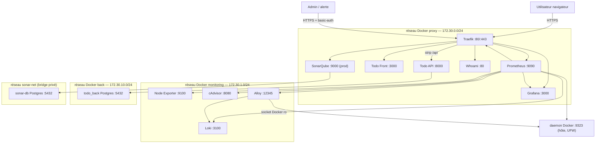
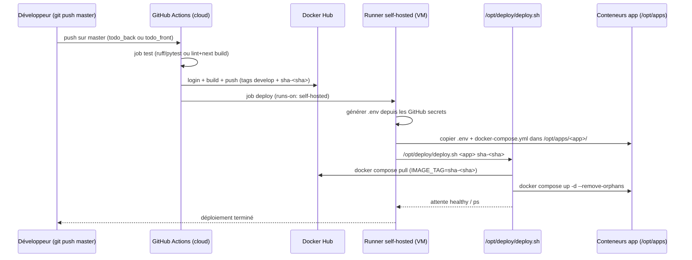

# Manuel d'exploitation et de déploiement — Infrastructure `infra-deploie`

> **Document de référence** pour comprendre, déployer, sécuriser, exploiter et
> maintenir la pile d'infrastructure déployée par le dépôt `infra-deploie`,
> ainsi que les applications qui y sont hébergées (`todo_back` / `todo_front`).
>
> Ce manuel est destiné aux administrateurs système. Il fournit les procédures
> complètes pour **reproduire l'infrastructure « clé en main » sur un nouveau
> serveur**, depuis la première connexion SSH jusqu'à la mise en production.

---

- **Version document :** 1.0
- **Date :** septembre 2026
- **Environnement de référence :** serveur unique Ubuntu 22.04/24.04 (VPS ou
  EC2) ; sur la VM de référence, IP privée `192.168.1.15`, URLs publiées via
  `*.192.168.1.15.nip.io`
- **Temps de mise en place complet (mesuré) :** ~1 à 2 heures, hors build des
  images applicatives

> **Principe directeur** : l'infrastructure est **portable et reproductible**.
> Tout élément décrit comme « **existant** » fait partie du dépôt et peut être
> instancié tel quel. Tout élément décrit comme « **recommandé** » est un
> complément nécessaire en production, **absent du dépôt** à la date de
> rédaction — il est systématiquement présenté dans un encadré
> `> 📌 Recommandation` distinct.

---

## Table des matières

1. [Introduction et périmètre](#1-introduction-et-périmètre)
2. [Vue d'ensemble de l'architecture](#2-vue-densemble-de-larchitecture)
3. [Prérequis et hypothèses](#3-prérequis-et-hypothèses)
4. [Arborescence du projet](#4-arborescence-du-projet)
5. [Documentation détaillée des fichiers et du code](#5-documentation-détaillée-des-fichiers-et-du-code)
6. [Sécurisation (durcissement)](#6-sécurisation-durcissement)
7. [Dépendances et versions](#7-dépendances-et-versions)
8. [Déploiement (de zéro et itératif)](#8-déploiement-de-zéro-et-itératif)
9. [Réseau, DNS, TLS](#9-réseau-dns-tls)
10. [Monitoring, logs et alertes](#10-monitoring-logs-et-alertes)
11. [Applications déployées : todo_back / todo_front et CI/CD](#11-applications-déployées--todo_back--todo_front-et-cicd)
12. [Validation / vérification (make verify)](#12-validation--vérification-make-verify)
13. [Exploitation quotidienne et politique de mise à jour](#13-exploitation-quotidienne-et-politique-de-mise-à-jour)
14. [Sauvegardes et reprise d'activité (DRP)](#14-sauvegardes-et-reprise-dactivité-drp)
15. [Dépannage (runbooks)](#15-dépannage-runbooks)
16. [Checklist de mise en production d'un serveur neuf](#16-checklist-de-mise-en-production-dun-serveur-neuf)
17. [Annexes](#17-annexes)

---

# 1. Introduction et périmètre

## 1.1 Objectif

Ce dépôt déploie une **pile de monitoring DevOps complète et auto-déployable**
(Terraform + Ansible) sur un serveur unique, en deux environnements (`dev` /
`prod`), de deux manières possibles :

| Mode | Infrastructure | Inventaire Ansible |
|---|---|---|
| **AWS** | `Terraform` provisionne l'instance EC2 + VPC/subnet/security group + EIP | Généré automatiquement (`make inventory`) |
| **VPS** (Contabo, Hetzner, OVH…) | Aucun Terraform — le serveur existe déjà | Rempli à la main (`hosts.ini`) |

Dans les deux cas, **le code de déploiement Ansible est identique**.

Au-delà de la pile de monitoring, le même serveur héberge **des applications
déployées en continu** via GitHub Actions : `todo_back` (API FastAPI +
PostgreSQL) et `todo_front` (Next.js).

## 1.2 Ce qui est couvert

- L'architecture globale et les dépendances entre composants.
- La documentation **bloc par bloc** de l'ensemble du code du dépôt.
- La procédure de **durcissement** du serveur avant déploiement.
- L'installation des dépendances et le déploiement de la pile.
- Le **monitoring, les logs et l'alerte** (Prometheus, Loki, Grafana).
- Le **déploiement des applications** par CI/CD et runners auto-hébergés.
- La validation post-déploiement, l'exploitation quotidienne et le dépannage.

## 1.3 Ce qui n'est **pas** couvert (explicitement manquant dans le dépôt)

| Sujet | État constaté | Où le trouver |
|---|---|---|
| **Sauvegardes** automatisées (base, fichiers, certificats) | **Absent** du dépôt | Chapitre 14 — procédure et scripts recommandés |
| **Provisionnement des runners self-hosted** par l'infra | Fait manuellement sur le serveur de référence, **absent** du code Ansible | Chapitre 11 — mode manuel documenté + rôle Ansible recommandé |
| **Alertmanager** (Prometheus) | Remplacé par l'**alerting natif Grafana** (provisionné) | Chapitre 10 |
| **Vault Ansible** (fichier chiffré réel) | Non committé (volontaire) ; seul l'exemple est fourni | Chapitre 8 |
| Réseaux **TLS internes** (Loki/Alloy/Prometheus) | Non chiffrés : flux sur les réseaux Docker privés | Chapitre 9 (choix assumé) |
| Rotation automatisée des secrets applicatifs | Manuelle | Chapitres 6 et 13 |

> 📌 **Recommandation** — avant mise en production réelle, traiter au minimum
> les sauvegardes et la rotation des secrets (chapitres 6, 14, 16).

## 1.4 Conventions du document

- `blocs de code` : commandes à exécuter sur le serveur, sur le poste
  administrateur ou dans un conteneur — le contexte est précisé en commentaire
  (`# poste admin`, `# serveur`, `# conteneur`).
- `> ⚠️ Avertissement` : point de vigilance important (risque de perte d'accès,
  d'écriture, etc.).
- `> 📌 Recommandation` : complément **non présent dans le dépôt**, proposé à
  part.
- **Mermaid** : schémas rendus par les éditeurs Markdown compatibles (GitHub,
  Obsidian, VS Code).

---

# 2. Vue d'ensemble de l'architecture

## 2.1 Principe : un serveur = une pile complète

L'infrastructure tient sur **un seul serveur**. Le point d'entrée du trafic
externe est **Traefik** (ports `80`/`443` publiés). **Aucun autre conteneur ne
publie de port sur l'hôte** : tout le reste circule sur des réseaux Docker
internes.

```
                     ┌──────────────────────────────────────────────┐
  Internet ──(80/443)►│  Traefik (reverse-proxy TLS)               │
  user / alerte      │   ├─ Grafana    : grafana.<IP>.nip.io        │
                     │   ├─ Prometheus : prometheus.<IP>.nip.io     │
                     │   ├─ Traefik UI : traefik.<IP>.nip.io        │
                     │   ├─ Whoami     : whoami.<IP>.nip.io         │
                     │   ├─ SonarQube  : sonar.<IP>.nip.io (prod)   │
                     │   └─ Todo App   : todo.<IP>.nip.io (/api+UI) │
                     └──────────────┬───────────────────────────────┘
                                    │  réseaux Docker internes
                   ┌────────────────┴────────────────────────────────┐
                   │  Prometheus ◄── node-exporter / cadvisor /      │
                   │                 daemon-docker (9323) / Traefik / │
                   │                 grafana / loki / alloy           │
                   │  Loki      ◄── Grafana Alloy (logs Docker,      │
                   │                 syslog, access logs Traefik)     │
                   │  Grafana   ──► contact points e-mail/Telegram/  │
                   │                 Slack (+ Discord désactivé)      │
                   │  SonarQube ──► PostgreSQL 16                     │
                   └──────────────────────────────────────────────────┘
```

## 2.2 Schéma Mermaid — vue applicative et réseau



## 2.3 Schéma Mermaid — pipeline CI/CD (déploiement applicatif)



## 2.4 Rôle et dépendances de chaque composant

| Composant | Rôle | Dépend de | Dépendance de |
|---|---|---|---|
| **Traefik** | Reverse-proxy, TLS (ACME), routage par labels | Réseau `proxy` ; `docker.sock` (ro) | Tout service web (routes) |
| **whoami** | Service de test de routage | Réseau `proxy` | — |
| **Node Exporter** | Métriques hôte (CPU, RAM, disque, réseau, load) | Réseau `monitoring` | Prometheus (scrape) |
| **cAdvisor** | Métriques conteneurs (CPU, RAM, I/O, restarts) | Réseau `monitoring` ; `/var/lib/docker` ro | Prometheus (scrape) |
| **Prometheus** | Collecte + TSDB, `docker_sd` | Réseaux `proxy`+`monitoring` ; `docker.sock` ro | Grafana, alerting |
| **Loki** | Agrégation/stockage des logs | Réseau `monitoring` | Alloy (push) ; Grafana (lecture) |
| **Alloy** | Collecteur de logs → Loki | `docker.sock` ro ; `/var/log` ; `/opt/traefik/logs` | Loki |
| **Grafana** | Console + alerting (datasources, dashboards, contact points) | Réseaux `proxy`+`monitoring` | Prometheus + Loki |
| **SonarQube** | Qualité du code (prod) | Réseau `proxy`+`sonar-net` | sonar-db |
| **sonar-db** | Base PostgreSQL de SonarQube | `sonar-net` | SonarQube |
| **daemon Docker** | Métriques 9323 + socket (docker_sd/Alloy/runners) | UFW (autorisation réseaux internes) | Prometheus, Alloy, runners |
| **Trivy** | Scan de vulnérabilités des images de conteneurs (timer quotidien) | `/opt/trivy` ; `docker.sock` ro (conteneur éphémère) | Rapports JSONL → Alloy → Loki |
| **todo_back** | API FastAPI + migrations Alembic | `proxy`+`back` | todo_back_postgres |
| **todo_back_postgres** | Base PostgreSQL de l'application | `back` | todo_back |
| **todo_front** | Front Next.js (standalone) | `proxy` | todo_back (via Traefik `/api`) |

## 2.5 Réseaux Docker (subnets fixes)

| Réseau | Subnet | Gateway | Usage |
|---|---|---|---|
| `proxy` | `172.30.0.0/24` | `172.30.0.1` | Traefik + services exposés (web) |
| `monitoring` | `172.30.1.0/24` | `172.30.1.1` | Collecteurs et sources de métriques (intranet) |
| `back` | `172.30.10.0/24` | `172.30.10.1` | Données / API privées des apps (jamais exposé) |
| `sonar-net` | bridge privé (auto) | — | SonarQube ↔ sonar-db |

> **Pourquoi des subnets fixes ?** Les règles **UFW** de la VM autorisent le
> daemon Docker (9323) depuis exactement les subnets `proxy` et `monitoring`.
> Sans subnets épinglés, ces règles seraient fragiles après recréation des
> réseaux.

## 2.6 Réseaux et flux externes

| Flux | Source → Destination | Ports | Protocole | Chiffré |
|---|---|---|---|---|
| HTTP | Internet → Traefik | 80 | TCP | non (redirigé 301 vers HTTPS) |
| HTTPS | Internet → Traefik | 443 | TCP | oui (Let's Encrypt / selfsigned) |
| HTTPS (ACME challenge HTTP-01) | Let's Encrypt → Traefik | 80 | TCP | — |
| SSH | Admin → serveur | 22 | TCP | oui (clé) |
| Métriques daemon Docker | réseaux internes → hôte | 9323 | TCP | non (interne) |
| Scopus Prometheus (internes) | Prometheus → cibles | 9100/8080/8082/9090/3000/3100/12345 | HTTP (interne) | non (interne) |

> ⚠️ Tous les flux internes (entre conteneurs) ne sont **pas** chiffrés. C'est
> un choix assumé : ils restent confinés aux réseaux Docker privés, jamais
> routés par Traefik. Pour aller plus loin en prod, voir chapitre 9.5.

---

# 3. Prérequis et hypothèses

## 3.1 Prérequis matériel et OS

| Élément | Valeur minimale constatée | Recommandé |
|---|---|---|
| CPU | 2 vCPU | 4 vCPU (SonarQube activé) |
| RAM | 4 Go | 8 Go |
| Disque | 20 Go (SSD) | 40 Go+ (images Docker, TSDB Prometheus, logs Loki, volumes Postgres) |
| OS | Ubuntu 22.04 | Ubuntu 22.04/24.04 x86_64 |
| Réseau | 1 IP publique | IP publique stable (ou EIP / domaine cinématique via DuckDNS) |

## 3.2 Prérequis du poste administrateur (contrôleur)

Outils requis **sur le poste depuis lequel on déploie** :

- `terraform` ≥ 1.9 (mode AWS uniquement)
- `ansible` ≥ 2.14 + collections (voir 3.3)
- `docker` + plugin `docker compose` (pour lancer des conteneurs éphémères de
  test/curl, cf. playbook `verify.yml`)
- `curl`, `git`, `make`
- Clé SSH privée pour l'instance (fichier `.pem` en mode AWS ; clé locale en
  mode VPS)
- (optionnel) `ansible-vault` — fourni avec Ansible

> ℹ️ Sur Windows, l'environnement de référence utilise **PowerShell +
> OpenSSH** (`ssh -i …`). Le code Ansible/Terraform est exécuté depuis la
> même machine ; les commandes `make` décrites supposent un shell POSIX
> (WSL, Git Bash ou tout serveur Linux dédié).

## 3.3 Collections Ansible requises

Fichier : `ansible/requirements.yml`

```yaml
collections:
  - name: community.docker
    version: ">=3.4.0"
  - name: community.general
    version: ">=8.0.0"
```

Installation :

```bash
# poste admin
ansible-galaxy collection install -r ansible/requirements.yml
```

## 3.4 Hypothèses de fonctionnement

- Le serveur (VPS ou EC2) est **nouveau ou vierge** (Ubuntu minimal) ; on
  applique le chapitre 6 (durcissement) avant tout déploiement.
- Le contrôleur (poste admin) possède une **clé SSH** autorisée sur le compte
  `ansible_user` (par défaut `ubuntu`, voir `group_vars/all.yml`).
- En mode AWS : la **key pair** `ssh_key_name` existe déjà
  (`aws ec2 create-key-pair --key-name monitoring-key`).
- Les hostnames sont **nip.io** par défaut (aucune configuration DNS) ; un vrai
  domaine ou DuckDNS est optionnel (chapitre 9).
- En production, l'IP admin (`admin_cidr`) doit être **restreinte** (jamais
  `0.0.0.0/0`).
- Docker Hub est le registre d'images applicatives (login optionnel pour les
  limites de pull, via vault `docker_hub_*`).

---

# 4. Arborescence du projet

> Arbre complet des fichiers du dépôt `infra-deploie` (les fichiers générés /
> secrets ne sont pas représentés : `*.tfvars`, `hosts.ini` réels, `vault.yml`,
> `*.pem`, `*.key`, `.terraform/`).

```
infra-deploie/
├── .gitignore                          # exclusions (secrets, tfvars, state, vault)
├── Makefile                            # orchestration (preflight/plan/apply/inventory/configure/deploy/verify/destroy/ssh/urls)
├── README.md                           # guide rapide du dépôt
├── ansible/
│   ├── ansible.cfg                     # config Ansible (roles_path, inventaire par défaut, pipelining)
│   ├── requirements.yml                # collections community.docker + community.general
│   ├── group_vars/
│   │   ├── all.yml                     # variables communes (réseaux, images, alertes, alerting, admin)
│   │   ├── dev.yml                     # spécificités DEV (staging ACME, rétention courte, sonar off)
│   │   ├── prod.yml                    # spécificités PROD (ACME réel, rétention longue, sonar on)
│   │   └── vault.yml.example           # gabarit des secrets chiffrés (chapitre 8)
│   ├── inventories/
│   │   ├── dev/hosts.ini.example       # gabarit inventaire DEV (IP à renseigner)
│   │   └── prod/hosts.ini.example      # gabarit inventaire PROD
│   ├── playbooks/
│   │   ├── site.yml                    # provisionnement pile monitoring (rôles commun→grafana→sonar)
│   │   ├── app-deploy.yml              # préparation hôte CI/CD (app_deploy)
│   │   └── verify.yml                  # contrôles post-déploiement (idempotent)
│   └── roles/
│       ├── common/                     # durcissement : UFW, fail2ban, unattended-upgrades, DuckDNS, timezone
│       ├── docker/                     # install Docker + daemon.json + réseaux proxy/monitoring
│       ├── traefik/                    # reverse-proxy TLS + whoami (routes/middlewares/acme)
│       ├── node_exporter/              # métriques hôte
│       ├── cadvisor/                   # métriques conteneurs
│       ├── prometheus/                 # collecte + docker_sd + rétention
│       ├── loki/                       # stockage logs
│       ├── alloy/                      # collecte logs → Loki
│       ├── grafana/                    # datasources, dashboards, alerting (templates+JSON)
│       │   └── files/dashboards/       # overview, infrastructure, docker, traefik, logs (JSON)
│       ├── sonarqube/                  # SonarQube + PostgreSQL (prod)
│       └── app_deploy/                 # CI/CD : /opt/apps, clé restreinte, deploy.sh, start-apps, réseau back
├── scripts/
│   └── gen-bcrypt-hash.sh              # génération des hash bcrypt basic-auth Traefik
└── terraform/
    ├── backend.tf                      # backend S3 + DynamoDB (état partagé, par workspace)
    ├── versions.tf                     # terraform ≥1.9, provider aws ~> 5.0
    ├── providers.tf                    # région + default_tags
    ├── variables.tf                    # catalogue des variables (env, instance, CIDR, disque…)
    ├── main.tf                         # routage des modules (network/security/ec2) + data AMI
    ├── outputs.tf                      # public_ip, private_ip, ansible_inventory, …
    ├── dev.tfvars.example              # gabarit tfvars DEV
    ├── prod.tfvars.example             # gabarit tfvars PROD
    ├── .terraform.lock.hcl             # verrouillage des versions des providers
    └── modules/
        ├── network/                    # VPC + subnet public + IGW + route table
        ├── security/                   # security group (22 admin, 80/443 ouvert)
        └── ec2/                        # instance + EIP + IAM SSM + user-data
            └── user_data.tpl           # script de boot (install Python3 minimal)
```

> Les composants **applicatifs** (hors de ce dépôt, mais intégrés à
> l'infrastructure de référence) sont détaillés au chapitre 5.8 :
>
> ```
> todo_back/
> ├── .github/workflows/ci.yml           # pipeline CI/CD du back
> ├── deploy/docker-compose.yml          # compose de prod (déposé par le CD)
> └── entrypoint.sh                      # migrations Alembic + uvicorn (ROOT_PATH)
> todo_front/
> ├── .github/workflows/ci.yml           # pipeline CI/CD du front
> └── deploy/docker-compose.yml          # compose de prod (déposé par le CD)
> ```
---

# 5. Documentation détaillée des fichiers et du code

> Chaque fichier est analysé dans l'ordre : **objectif, contenu bloc par bloc,
> variables/paramètres, dépendances, risques et éléments à personnaliser**.

---

## 5.1 Terraform — racine

### 5.1.1 `terraform/versions.tf`

**Objectif** : verrouille la version de Terraform et du provider AWS.

```hcl
terraform {
  required_version = ">= 1.9.0"
  required_providers {
    aws = {
      source  = "hashicorp/aws"
      version = "~> 5.0"
    }
  }
}
```

- `required_version` : impose une version récente (les fonctionnalités
  `-chdir`, workspaces et `-var-file` utilisées par le Makefile nécessitent
  ≥ 1.9).
- `required_providers` : émet un binaire `aws` compatible (famille 5.x, lock
  fichier `.terraform.lock.hcl`).
- **Risques** : un provider plus ancien peut manquer d'attributs récents ;
  un changement majeur (`aws ~> 6.0`) exigerait de relire la doc des
  ressources.
- **À personnaliser** : rien (mais mettre à jour `version` lors des montées
  de version voulues).

### 5.1.2 `terraform/providers.tf`

```hcl
provider "aws" {
  region = var.aws_region
  default_tags {
    tags = {
      Project     = var.project_name
      Environment = var.environment
      ManagedBy   = "terraform"
    }
  }
}
```

- `region` : par défaut `eu-west-3` (voir `variables.tf`).
- `default_tags` : tagge **toutes** les ressources créées — indispensable pour
  identifier/côtoyer les coûts.
- **Dépendances** : variable `aws_region`, `project_name`, `environment`.
- **Éléments à personnaliser** : région AWS.

### 5.1.3 `terraform/backend.tf`

**Objectif** : stockage de l'état Terraform dans S3 (partagé, chiffré) +
verrouillage dynamoDB.

```hcl
terraform {
  backend "s3" {
    bucket         = "infra-deploie-tfstate-examen"
    key            = "monitoring/${workspace}/terraform.tfstate"
    region         = "eu-west-3"
    encrypt        = true
    dynamodb_table = "terraform-lock"
  }
}
```

- Un **workspace** = un environnement (`dev`/`prod`) → deux clés d'état
  distinctes dans le même bucket.
- `encrypt = true` : chiffrement côté serveur de l'objet S3.
- `dynamodb_table` : verrouillage pessimiste anti-concurrence entre `apply`
  simultanés.
- **Bootstrap initial** (une seule fois) :
  ```bash
  # poste admin
  aws s3api create-bucket --bucket infra-deploie-tfstate-examen \
      --region eu-west-3 --create-bucket-configuration LocationConstraint=eu-west-3
  aws s3api put-bucket-versioning --bucket infra-deploie-tfstate-examen \
      --versioning-configuration Status=Enabled
  aws dynamodb create-table --table-name terraform-lock \
      --attribute-definitions AttributeName=LockID,AttributeType=S \
      --key-schema AttributeName=LockID,KeyType=HASH \
      --billing-mode PAY_PER_REQUEST
  ```
- **Risques** : perdre le bucket = perdre l'état → **activer le versioning**
  (fait ci-dessus) et mettre en place une sauvegarde (chapitre 14).
- **Variable locale (dépannage)** : commenter le bloc S3 et utiliser
  `backend "local" { path = "terraform.tfstate" }`.
- ⚠️ **Avertissement** : ne jamais oublier de re-synchroniser le local et le
  distant en cas de bascule backend local ⇄ S3.

### 5.1.4 `terraform/variables.tf`

Catalogue des variables avec validations. Principales :

| Variable | Type | Défaut | Rôle | À personnaliser |
|---|---|---|---|---|
| `aws_region` | string | `eu-west-3` | Région AWS | Oui (selon emplacement) |
| `environment` | string | — | `dev` ou `prod` (obligatoire, validé) | Obligatoire |
| `project_name` | string | `infra-deploie` | Préfixe de nommage | Oui |
| `instance_type` | string | — | Type EC2 | Oui |
| `ssh_key_name` | string | — | Key pair EC2 existante | Obligatoire |
| `ami_id` | string | `""` | AMI Ubuntu 22.04 (sinon data source Canonical) | Optionnel |
| `vpc_cidr` / `subnet_cidr` | string | — | Plan d'adressage | Oui |
| `availability_zone` | string | `eu-west-3a` | AZ du subnet public | Oui |
| `admin_cidr` | string | — | CIDR admin : SSH + allowlist interfaces protégées | **Oui (sécurité)** |
| `root_volume_size` | number | `20` | Taille disque (Go) | Oui |
| `root_volume_type` | string | `gp3` | Type disque | Optionnel |
| `extra_tags` | map(string) | `{}` | Tags additionnels | Optionnel |
| `domain` | string | `""` | Domaine réel (optionnel) | Optionnel |
| `ansible_user` | string | `ubuntu` | Utilisateur Ansible | Selon OS |

- ⚠️ `admin_cidr` doit être **IP /32 de l'admin** en prod, jamais `0.0.0.0/0`.

### 5.1.5 `terraform/main.tf`

Relie les modules et résout l'AMI :

```hcl
locals {
  server_name = "${var.environment}-server"
  ami_id      = var.ami_id != "" ? var.ami_id : data.aws_ami.ubuntu[0].id
}
```

- `data "aws_ami" "ubuntu"` : recherche la dernière AMI Ubuntu 22.04 officielle
  Canonical (`owners = ["099720109477"]`).

Modules appelés (ordre logique : réseau → sécurité → instance) :
- `module "network"` (VPC, subnet, IGW, route).
- `module "security"` (SG : 22 restreint, 80/443 ouvert).
- `module "ec2"` (instance + EIP + IAM SSM + user-data).

**Dépendances** : chaque module reçoit les sorties du précédent
(`vpc_id`, `subnet_id`, `security_group_id`).

### 5.1.6 `terraform/outputs.tf`

Sorties consommées par le Makefile et les workflows :

| Output | Valeur | Usage |
|---|---|---|
| `public_ip` | EIP | URLs nip.io, `make ssh/urls`, inventaire |
| `private_ip` | IP privée | injectée dans templates Ansible |
| `instance_id` | id EC2 | opérations AWS |
| `server_name` | `dev-server`/`prod-server` | label Prometheus `server` |
| `security_group_id` | id SG | debugging |
| `ansible_inventory` | texte INI | écrit tel quel dans `hosts.ini` par `make inventory` |

> L'output `ansible_inventory` inclut `[all:vars] ansible_user`. C'est ce que
> `make inventory` recopie dans `ansible/inventories/<env>/hosts.ini`.

### 5.1.7 `terraform/dev.tfvars.example` / `prod.tfvars.example`

Gabarits de variables par environnement :

```hcl
environment      = "dev"
instance_type    = "t3.small"          # éligible Free Tier
ssh_key_name     = "monitoring-key"
admin_cidr       = "1.2.3.4/32"        # { ma_ip } — remplacer
vpc_cidr         = "10.0.0.0/16"
subnet_cidr      = "10.0.1.0/24"
root_volume_size = 20
```

- Copier en `dev.tfvars` / `prod.tfvars` puis adapter.
- ⚠️ `*.tfvars` sont **ignorés par git** (`.gitignore`) : ne jamais committer.

---

## 5.2 Terraform — modules

### 5.2.1 `terraform/modules/network/`

**Objectif** : VPC + subnet public + Internet Gateway + table de routage.

| Resource | Rôle |
|---|---|
| `aws_vpc.this` | VPC avec DNS support + hostnames |
| `aws_subnet.public` | Subnet public (IP publique attribuée au lancement) |
| `aws_internet_gateway.this` | Accès internet sortant |
| `aws_route_table.public` + association | Route `0.0.0.0/0` → IGW |

- Variables : `project_name`, `environment`, `vpc_cidr`, `subnet_cidr`,
  `availability_zone`, `extra_tags`.
- Sorties : `vpc_id`, `subnet_id`.
- **Personnalisation** : `vpc_cidr`/`subnet_cidr` (plan d'adressage),
  `availability_zone`.

### 5.2.2 `terraform/modules/security/`

**Objectif** : security group.

| Ingress | Port | Source |
|---|---|---|
| SSH | 22 | `admin_cidr` (**IP admin** — jamais 0.0.0.0/0) |
| HTTP | 80 | `0.0.0.0/0` (redirection + ACME HTTP-01) |
| HTTPS | 443 | `0.0.0.0/0` (Traefik) |
| Egress | tout | `0.0.0.0/0` |

- ⚠️ Ce contrôle est **doublé** par UFW dans le rôle `common` : l'un comme
  l'autre peuvent bloquer l'accès. Toute modification réseau doit être testée
  sur les deux niveaux (chapitre 9).

### 5.2.3 `terraform/modules/ec2/`

**Objectif** : instance + EIP + profil IAM SSM + user-data.

- **IAM** : rôle + policy `AmazonSSMManagedInstanceCore` + instance profile →
  permet **SSM Session Manager** (accès console AWS sans SSH ouvert).
- **Instance** :
  - `key_name` : key pair admin ;
  - `user_data` : via `user_data.tpl` (voir plus bas) ;
  - disque racine **chiffré** (`encrypted = true`), type/size paramétrés ;
  - `lifecycle { ignore_changes = [ami] }` : le remplacement de l'AMI ne
    recrée pas l'infra (patching éphémère). ⚠️ Ce choix signifie que les mises
    à jour système se font **dans la VM** (unattended-upgrades), pas par
    pourvoir.
- **EIP** : IP publique stable (les hostnames nip.io et le CI s'y réfèrent).

**`user_data.tpl`** (script de boot, minimal par conception) :

```bash
apt-get update -y
apt-get install -y python3 python3-apt python3-venv
# crée l'utilisateur ansible si différent de "ubuntu"
echo "user-data OK: python3 installé" > /var/log/user-data.log
```

> Toute la suite (UFW, Docker, Traefik, monitoring) est posée par **Ansible**
> au `make configure`. Le user-data ne doit **pas** dupliquer ces étapes.

---

## 5.3 Makefile (orchestration)

**Objectif** : enveloppe ergonomique autour de Terraform/Ansible.

| Cible | Fonction |
|---|---|
| `make help` | Liste les cibles |
| `make preflight ENV=dev` | Vérifie `terraform`/`ansible-playbook`/`docker`/`curl` |
| `make plan` / `apply` | Terraform plan/apply (workspace `ENV` + `-var-file`) |
| `make inventory` | Écrit `hosts.ini` depuis l'output `ansible_inventory` |
| `make configure` | `ansible-playbook site.yml` (`--ask-vault-pass` par défaut) |
| `make deploy` | `apply → inventory → configure` |
| `make verify` | `ansible-playbook verify.yml` |
| `make destroy` | `terraform destroy` (confirmation interactive) |
| `make ssh` | `ssh` vers l'IP (output Terraform ou inventaire) |
| `make urls` | Affiche les URLs de l'environnement |

**Variables** :
- `ENV ?= dev` ; `VAULT_ARGS ?= --ask-vault-pass` (remplaçable :
  `make configure ENV=prod VAULT_ARGS="--vault-password-file .vault-pass"`).
- `tf-select` : `terraform workspace select ENV` (ou `new`).

**Détails notables** :
- `get-ip`/`ssh`/`urls` préfèrent la sortie Terraform puis l'inventaire
  (fallback VPS).
- `destroy` demande confirmation explicite (`[y/N]`).
- ⚠️ `ssh` n'active pas `StrictHostKeyChecking` (comportement de
  `ansible.cfg`). Vérifier l'empreinte de la clé de l'hôte au premier accès.

---

## 5.4 Ansible — configuration générale

### 5.4.1 `ansible/ansible.cfg`

```ini
[defaults]
roles_path = ./roles
inventory  = inventories/dev/hosts.ini
host_key_checking = False
retry_files_enabled = False
interpreter_python = /usr/bin/python3

[ssh_connection]
pipelining = True

[privilege_escalation]
timeout = 60
```

- `roles_path` : rôles locaux du dépôt.
- `host_key_checking = False` : évite les prompts sur hôtes éphémères (AWS) —
  ⚠️ **à réévaluer** en prod (risque MITM) ; préférer fixer les empreintes en
  `known_hosts` pour une VM fixe.
- `pipelining = True` : améliore fortement la performance des tâches.
- `interpreter_python`: cible Ubuntu (python3).

### 5.4.2 `ansible/requirements.yml`

Déclare les collections `community.docker` (≥3.4.0) et `community.general`
(≥8.0.0). Installer avec `ansible-galaxy collection install -r …`.

### 5.4.3 `ansible/group_vars/all.yml`

Variables **communes** à tous les environnements. Blocs principaux :

- **Identité / connexion** :
  ```yaml
  environment_name: "{{ group_names[0] }}"
  ansible_user: ubuntu
  ansible_ssh_common_args: "-o StrictHostKeyChecking=no -o UserKnownHostsFile=/dev/null"
  ansible_ssh_private_key_file: "~/.ssh/monitoring-key.pem"
  ```
  ⚠️ `UserKnownHostsFile=/dev/null` : même remarque sécurité que ci-dessus.

- **Admin / hostnames** :
  ```yaml
  admin_cidr: ["0.0.0.0/0"]          # ⚠️ À RESTREINDRE EN PROD
  admin_email: admin@example.com      # email ACME
  grafana_host: "grafana.{{ public_ip }}.nip.io"
  prometheus_host: "prometheus.{{ public_ip }}.nip.io"
  traefik_host: "traefik.{{ public_ip }}.nip.io"
  sonar_host: "sonar.{{ public_ip }}.nip.io"
  whoami_host: "whoami.{{ public_ip }}.nip.io"
  ```
  `public_ip` est une **variable d'hôte** de l'inventaire.

- **TLS/ACME** : `traefik_cert_type`, `acme_is_staging` (true en dev), emails
  et hashes bcrypt (voir vault).

- **Réseaux Docker** (subnets fixes, cf. 2.5).
- **Images épinglées** :
  ```yaml
  images:
    traefik: "traefik:v3.7.13"
    node_exporter: "prom/node-exporter:v1.8.2"
    cadvisor: "ghcr.io/google/cadvisor:v0.60.5"
    prometheus: "prom/prometheus:v2.54.1"
    loki: "grafana/loki:3.2.2"
    alloy: "grafana/alloy:v1.3.1"
    grafana: "grafana/grafana:11.2.2"
    whoami: "traefik/whoami:v1.10.1"
sonarqube: "sonarqube:lts-community"
    postgres: "postgres:16-alpine"
    trivy: "aquasec/trivy:0.57.1"
  ```

- **Seuils d'alertes** (subject `alerts:`), **contact points** (`alerting:`),
  **rétention** (`monitoring_retention_days`, `loki_retention_hours`),
  **SonarQube** (off par défaut, chiffres mémoire), **DuckDNS** (vide = off),
  **intervalle de scrape** (15 s), **dashboards** provisionnés (dont `trivy`),
  **Trivy** (`trivy_schedule`, `trivy_severities`, `trivy_ignore_unfixed`,
  répertoires `/opt/trivy`).
  Voir détail au chapitre 10.

### 5.4.4 `ansible/group_vars/dev.yml`

- `acme_is_staging: true` (rate-limits Let's Encrypt évités).
- `monitoring_retention_days: 7` ; `loki_retention_hours: 72` (3 j).
- `enable_sonarqube: false` (RAM de l'instance dev trop juste).
- `app_deploy_user: papa` (utilisateur CD de la VM de référence).

### 5.4.5 `ansible/group_vars/prod.yml`

- `acme_is_staging: false`.
- `monitoring_retention_days: 30` ; `loki_retention_hours: 336` (14 j).
- `enable_sonarqube: true`.

### 5.4.6 `ansible/group_vars/vault.yml.example`

Gabarit des **secrets** (voir chapitre 8 pour la mise en place) :

| Variable | Usage |
|---|---|
| `grafana_admin_user` / `grafana_admin_password` | Compte admin Grafana |
| `prometheus_basic_auth_user` / `hash` | basic-auth Prometheus (Traefik) |
| `traefik_dashboard_basic_auth_user` / `hash` | basic-auth dashboard Traefik |
| `sonarqube_admin_current_password` / `new_password` / `db_password` | SonarQube |
| `alerting.email.*` / `telegram.*` / `slack.*` / `discord.*` | Contact points (remplace le bloc de all.yml) |
| `duckdns_token` / `duckdns_domains` | DuckDNS (optionnel) |

> ⚠️ Le bloc `alerting:` du vault **remplace** celui de `all.yml` (précédence
> group_vars). Il doit donc contenir **toutes** les clés `alerting`.

### 5.4.7 Inventaires dev/prod (`hosts.ini.example`)

```ini
[dev]
dev ansible_host=203.0.113.10 public_ip=203.0.113.10 private_ip=203.0.113.10 server_name=dev-server

[all:vars]
ansible_user=ubuntu
```

- Variables d'hôte attendues : `public_ip`, `private_ip`, `server_name`.
- En mode VPS : copier en `hosts.ini` et renseigner les IP.
- `hosts.ini` réel est **ignoré par git**.

---

## 5.5 Ansible — playbooks

### 5.5.1 `playbooks/site.yml`

**Provisions la pile complète** dans l'ordre :

```
pre_tasks : include_vars all.yml + vault.yml + <env>.yml puis assert
roles     : common → docker → traefik → node_exporter → cadvisor →
            prometheus → loki → alloy → grafana → sonarqube (si enable_sonarqube)
post_tasks: récapitulatif des URLs
```

- Déclenchement : `make configure ENV=<env>` (ou
  `ansible-playbook -i inventories/<env>/hosts.ini playbooks/site.yml --ask-vault-pass`).
- **Idempotence** : ré-exécutable librement (reconvergure).

### 5.5.2 `playbooks/app-deploy.yml`

Prépare la **VM à recevoir des applications déployées par GitHub Actions**
(rôle `app_deploy`) : `/opt/apps`, clé ed25519 CI/CD restreinte + wrapper,
`deploy.sh`, `start-apps.service`, réseau Docker `back`.
(Chapitre 11 — note : la VM de référence passe désormais par des **runners
self-hosted** plutôt que par la clé restreinte+wrapper ; les deux mécanismes
sont documentés.)

### 5.5.3 `playbooks/verify.yml`

Contrôles post-déploiement **idempotents** :

| Vérification | Détail |
|---|---|
| Conteneurs attendus | traefik, whoami, node-exporter, cadvisor, prometheus, loki, alloy, grafana (+ sonarqube/sonar-db si prod) |
| Ports publiés | seuls `80`/`443` (différence vs [80,443] vide) |
| Prometheus healthy | `docker run curl` sur le réseau monitoring |
| Prometheus (https) exige auth | code HTTP = `401` sans credentials |
| Grafana accepte admin | `curl -u admin:…` → `/api/org` |
| Loki ready + ingestion | `/ready` + `/loki/api/v1/labels` non vide |
| SonarQube répond (si prod) | `/api/system/status` |

- Utilise de petits conteneurs `curlimages/curl:8.7.1` jetables sur les
  réseaux `monitoring`/`proxy` (aucun outil à installer sur l'hôte).

---
---

## 5.6 Ansible — rôles (documentation détaillée)

### 5.6.1 `roles/common` — durcissement de base

**Fichiers** : `tasks/main.yml`, `defaults/main.yml`, `handlers/main.yml`,
`templates/jail.local.j2`, `templates/duckdns-update.sh.j2`.

**Rôle** : paquets de base, fuseau horaire, **UFW**, **fail2ban**,
**unattended-upgrades**, **DuckDNS** (optionnel).

**Tâches principales (`tasks/main.yml`)** :

| Tâche | Description | Risque / point d'attention |
|---|---|---|
| `apt update` | Actualise le cache (cache 1 h) | — |
| apt : ufw, fail2ban, unattended-upgrades, curl, ca-certificates, gnupg, python3-apt | Paquets de base | — |
| `community.general.timezone` | Fuseau (défaut UTC) | Se fait aussi en prod : attention aux logs datés |
| UFW default deny incoming / allow outgoing | Politique par défaut | ⚠️ appliquée **avant** l'activation |
| UFW allow **22/80/443** | Ports visibles | ⚠️ **Ne pas ressaisir un mauvais port SSH** (risque coupure) |
| UFW allow `9323` depuis subnets Docker | Métriques daemon Docker | Sans cette règle, le scrape `job: docker` échoue |
| UFW enable | Active le pare-feu | — |
| `DEFAULT_FORWARD_POLICY="ACCEPT"` | Forwarding requis pour Docker | Sans cela, les conteneurs n'ont pas de connectivité sortante → impossible de joindre Traefik |
| fail2ban template `jail.local` | Jail SSH (`maxretry`, `bantime`, `findtime`) | Voir 5.6.1.1 |
| systemd fail2ban | start + enable | — |
| unattended-upgrades `20auto-upgrades` | Màj packages auto | — |
| DuckDNS script + cron `*/10` | Màj IP des sous-domaines | Seulement si `duckdns_token`+`duckdns_domains` renseignés |

**Config fail2ban (`jail.local.j2`)** :

```ini
[DEFAULT]
bantime  = 1h
findtime = 600
maxretry = 5
[sshd]
enabled  = true
port     = ssh
```

**Variables (`defaults/main.yml`)** : `timezone`, `fail2ban_maxretry`,
`fail2ban_bantime`, `fail2ban_findtime`, `docker_metrics_port` (9323),
`docker_metrics_allow_cidrs` (subnets proxy+monitoring),
`unattended_upgrades_mail`.

> ⚠️ Sur la VM de référence, le port SSH est **22 standard** : `jail.local`
> cible `port = ssh`. Si l'on change le port SSH (recommandé en durcissement),
> adapter cette valeur.

### 5.6.2 `roles/docker` — moteur + daemon + réseaux

**Rôle** : installe Docker CE (dépôt officiel), configure `daemon.json`,
crée les réseaux `proxy` et `monitoring`.

**Étapes** :
1. Dépendances `apt` (`ca-certificates`, `curl`, `gnupg`).
2. Clé GPG officielle `/etc/apt/keyrings/docker.asc`.
3. Dépôt APT docker (arch détectée `x86_64`→`amd64`, release détectée).
4. Paquets : `docker-ce`, `docker-ce-cli`, `containerd.io`,
   `docker-buildx-plugin`, `docker-compose-plugin`, `python3-docker`.
5. Service `docker` activé au boot.
6. Utilisateur `ansible_user` ajouté au groupe `docker`.
7. GID docker mémorisé (pour `docker_sd` de Prometheus).
8. `daemon.json` + restart handler.

**`daemon.json.j2`** :

```json
{
  "log-driver": "json-file",
  "log-opts": { "max-size": "10m", "max-file": "3" },
  "metrics-addr": "0.0.0.0:9323",
  "live-restore": true
}
```

- **Rotation des logs conteneurs** : 10 Mo / 3 fichiers → évite le disque plein.
- **`metrics-addr`** : expose les métriques du daemon sur `9323` (scrapé par
  Prometheus, filtré UFW aux subnets internes).
- **`live-restore`** : les conteneurs restent up lors d'un redémarrage du
  démon (bascule de services).

**Réseaux** : `proxy` (br-proxy), `monitoring` (br-monitoring) en bridge, avec
subnets/gateway épinglés (cf. 2.5).

> ⚠️ Le `daemon.json` **surcharge** la configuration Docker standard : après
> modification, les handlers redémarrent Docker (`systemctl restart docker`),
> ce qui **redémarre le démon**. `live-restore` limite l'impact sur les
> conteneurs au repos.

### 5.6.3 `roles/traefik` — reverse-proxy TLS

**Rôle** : Traefik + whoami, config statique, config dynamique, `acme.json`,
compose.

**Tâches** :
- Répertoires `/opt/traefik`, `/opt/traefik/logs`.
- Templates : `traefik.yml` (statique), `dynamic.yml` (middlewares), compose.
- `acme.json` (touch, mode 0600).
- `docker_compose_v2` (`state: present`, `pull: missing`).
- Attente : port 443 puis routage HTTPS whoami (retries 10 × 5 s).

**Compose (`docker-compose.yml.j2`)** — points structurants :

```yaml
services:
  traefik:
    ports: ["80:80", "443:443"]          # seul à publier
    volumes:
      - /var/run/docker.sock:/var/run/docker.sock:ro
      - ./traefik.yml:/etc/traefik/traefik.yml:ro
      - ./dynamic.yml:/etc/traefik/dynamic.yml:ro
      - ./acme.json:/etc/traefik/acme.json
      - ./logs:/var/log/traefik
    labels:                               # dashboard exposé via Traefik lui-même
      - "traefik.http.routers.traefik.rule=Host(`{{ traefik_host }}`)"
      - "traefik.http.routers.traefik.service=api@internal"
      - "traefik.http.routers.traefik.middlewares=basic-auth-traefik@file,allowlist-admin@file"
  whoami:
    image: "{{ images.whoami }}"
    expose: ["80"]
    labels:
      - "traefik.http.routers.whoami.rule=Host(`{{ whoami_host }}`)"
      - "traefik.http.services.whoami.loadbalancer.server.port=80"
networks:
  proxy:     { external: true }
  monitoring:{ external: true }
```

> ℹ️ Traefik est sur **deux réseaux** : `proxy` (routage) et `monitoring`
> (scraping des métriques 8082 par Prometheus).

**Statique (`traefik.yml.j2`)** — points :

```yaml
api:      { dashboard: true, debug: false }
ping:     true
entryPoints:
  web:      { address: ":80", http.redirections.entryPoint → websecure (permanent) }
  websecure:{ address: ":443" }
  traefik:  { address: ":8080" }     # dashboard interne (non publié)
  metrics:  { address: ":8082" }     # métriques Prometheus (non publié)
metrics:
  prometheus: { entryPoint: metrics, addEntryPointsLabels: true, addServicesLabels: true }
providers:
  docker: { endpoint: "unix:///var/run/docker.sock", exposedByDefault: false, network: proxy, watch: true }
  file:   { filename: /etc/traefik/dynamic.yml, watch: true }
accessLog:
  filePath: "/var/log/traefik/access.log"
  format: json
  bufferingSize: 100
certificatesResolvers:
  letsencrypt:
    acme:
      caServer: "<staging si acme_is_staging>"   # dev
      email: "{{ admin_email }}"
      storage: /etc/traefik/acme.json
      httpChallenge: { entryPoint: web }
```

- `exposedByDefault: false` : seuls les conteneurs avec `traefik.enable=true`
  sont routés.
- Le mode `selfsigned` (`traefik_cert_type: selfsigned`) supprime le résolveur
  ACME et sert le certificat auto-généré de Traefik (avertissement navigateur).
- **Access logs JSON** consommés par Alloy (stage.json).

**Dynamique (`dynamic.yml.j2`)** — middlewares partagés :

```yaml
http:
  middlewares:
    basic-auth-prom:     basicAuth { users: [ "user:bcrypt-hash" ] }
    basic-auth-traefik:  basicAuth { users: [ "user:bcrypt-hash" ] }
    allowlist-admin:     ipAllowList { sourceRange: {{ admin_cidr }} }
    security-headers:    headers { SAMEORIGIN, nosniff, XSS, referrer, permissionsPolicy }
```

- **bcrypt** : hashs précalculés par `scripts/gen-bcrypt-hash.sh`, stockés dans
  le vault (pas de dépendance passlib à l'exécution).
- ⚠️ `admin_cidr` liste = `[{...}]` ; si vide, allowlist inactive → protection
  uniquement basic-auth.

### 5.6.4 `roles/node_exporter` — métriques hôte

**Compose** :

```yaml
node-exporter:
  image: prom/node-exporter:v1.8.2
  user: "65534:65534"
  networks: [monitoring]
  expose: ["9100"]
  volumes:
    - /proc:/host/proc:ro
    - /sys:/host/sys:ro
    - /:/rootfs:ro
  command:
    - --path.procfs=/host/proc
    - --path.sysfs=/host/sys
    - --path.rootfs=/rootfs
    - --collector.filesystem.mount-points-exclude=^/(sys|proc|dev|host|etc|var/lib/docker)($$|/)
```

- **`collector.filesystem.mount-points-exclude`** : évite les doubles comptes
  (mounts Docker, sysfs, proc).
- Vérification : conteneur jetable `curl` sur `:9100/metrics` (retries 10).

### 5.6.5 `roles/cadvisor` — métriques conteneurs

**Compose** : cAdvisor en `:8080` sur `monitoring`, volumes ro (`/`,
`/var/run`, `/sys`, `/var/lib/docker`, `/dev/disk`).

- `CADVISOR_HEALTHCHECK_URL: "http://localhost:8080/"` : corrige le healthcheck
  intégré (sinon il sonde le mauvais port).

### 5.6.6 `roles/prometheus` — collecte

**Compose** :

```yaml
prometheus:
  user: "{{ prometheus_uid }}:{{ prometheus_uid }}"     # 65534:65534
  group_add: ["{{ docker_group_gid | default(988) }}"]  # lecture docker.sock
  networks: [proxy, monitoring]
  expose: ["9090"]
  extra_hosts: ["host.docker.internal:host-gateway"]
  volumes:
    - ./prometheus.yml:/etc/prometheus/prometheus.yml:ro
    - ./data:/prometheus
    - /var/run/docker.sock:/var/run/docker.sock:ro
  command:
    - --config.file=/etc/prometheus/prometheus.yml
    - --storage.tsdb.path=/prometheus
    - --storage.tsdb.retention.time={{ prometheus_retention }}   # examples: 7d/30d
    - --web.external-url=https://{{ prometheus_host }}
    - --web.route-prefix=/
```

- Labels Traefik : route `prometheus_host`, middlewares
  `basic-auth-prom@file,allowlist-admin@file`, certresolver LE.

**Métriques scrapées** (`prometheus.yml.j2`), toutes avec
`environment`/`server` en labels :

| Job | Cible |
|---|---|
| `prometheus` | `localhost:9090` |
| `node_exporter` | `node-exporter:9100` |
| `cadvisor` | `cadvisor:8080` |
| `traefik` | `traefik:8082` |
| `docker` | `host.docker.internal:9323` (intervalle 30 s) |
| `grafana` | `grafana:3000/metrics` |
| `loki` | `loki:3100/metrics` |
| `alloy` | `alloy:12345/metrics` |
| `docker-containers` | **docker_sd** : conteneurs label `prometheus.scrape=true` |

**Job `docker-containers` (docker_sd + relabels)** :

- `keep` si `__meta_docker_container_label_prometheus_scrape == "true"`.
- `prometheus.port` : remplace le port du `__address__`.
- `prometheus.path` : remplace `__metrics_path__` (défaut `/metrics`).
- ajoute `environment`/`server`.

> ℹ️ **Auto-scrape des apps** : pour qu'une app soit scrapée automatiquement,
> il suffit de lui poser `prometheus.scrape=true` (+ `prometheus.port` /
> `prometheus.path`) dans son compose. C'est utilisé par les apps de la VM de
> référence.

### 5.6.7 `roles/loki` — stockage des logs

**Compose** : Loki `:3100` sur `monitoring`, user `10001:10001`, volume
`./data:/loki`.

**Config (`loki.yml.j2`)** — mode **standalone**, stockage **filesystem** :

```yaml
auth_enabled: false
common:
  path_prefix: /loki
  storage:
    filesystem:
      chunks_directory: /loki/chunks
      rules_directory: /loki/rules
  replication_factor: 1
schema_config:
  configs:
    - from: 2024-01-01
      store: tsdb
      object_store: filesystem
      schema: v13
      index: { prefix: index_, period: 24h }
limits_config:
  retention_period: {{ loki_retention }}        # 72h (dev) / 336h (14j prod)
  allow_structured_metadata: true
compactor:
  working_directory: /tmp/compactor
  retention_enabled: true
  delete_request_store: filesystem
```

- **Rétention** appliquée par le **compactor** (pas uniquement le schéma).
- ⚠️ Loki **n'exige pas d'authentification** (`auth_enabled: false`) : il vit
  sur le réseau interne `monitoring`. Ne **jamais** l'exposer hors de la VM.

### 5.6.8 `roles/alloy` — collecteur de logs

**Config (`config.alloy.j2`, format River)** — 3 sources + parsing :

| Bloc | Rôle |
|---|---|
| `discovery.docker "containers"` | Découverte des conteneurs via le socket |
| `discovery.relabel "containers"` | Labels lisibles : `container`, `service` (compose_service), `compose_project`, `image` |
| `loki.write "default"` | Point de sortie `http://loki:3100/loki/api/v1/push` + `external_labels { environment, server }` |
| `loki.source.docker "docker_logs"` | Logs des conteneurs Docker |
| `loki.source.file "system_logs"` | `/var/log/syslog` + `/var/log/auth.log` |
| `loki.source.file "traefik_access"` + `loki.process "traefik"` | Access logs JSON Traefik → stage.json (status, method, duration_ms, router, source, proto) |

**Compose** :

```yaml
alloy:
  expose: ["12345"]
  mem_limit: 512m
  volumes:
    - ./config.alloy:/etc/alloy/config.alloy:ro
    - /var/run/docker.sock:/var/run/docker.sock:ro
    - /var/log:/var/log:ro
    - /opt/traefik/logs:/logs/traefik:ro
  command:
    - run
    - --server.http.listen-addr=0.0.0.0:12345
    - --storage.path=/var/lib/alloy/data
    - --stability.level=generally-available
    - /etc/alloy/config.alloy
```

**Pourquoi le volume `/opt/traefik/logs:/logs/traefik:ro` (et pas `/var/log/
traefik`) ?** `runc` ne peut pas créer un point de montage `/var/log/traefik`
à travers un bind `ro` sur `/var/log` (EROFS). D'où le bind séparé du dossier
Traefik.

### 5.6.9 `roles/grafana` — console, dashboards, alerting

**Tâches** : répertoires, templates datasources/dashboards/contact-points/
policies/rules, copie des dashboards JSON, compose, healthcheck.

**Compose** :

```yaml
grafana:
  user: "472:472"
  mem_limit: 384m
  networks: [proxy, monitoring]
  expose: ["3000"]
  environment:
    GF_PATHS_PROVISIONING: /etc/grafana/provisioning
    GF_SERVER_ROOT_URL: "https://{{ grafana_host }}/"
    GF_SERVER_DOMAIN: "{{ grafana_host }}"
    GF_SERVER_HTTP_PORT: "3000"
    GF_SECURITY_ADMIN_USER: "{{ grafana_admin_user }}"
    GF_SECURITY_ADMIN_PASSWORD: "{{ grafana_admin_password }}"
    GF_SECURITY_DISABLE_GRAVATAR: "true"
    GF_USERS_ALLOW_SIGN_UP: "false"
    GF_ALERTING_ENABLED: "true"
    GF_UNIFIED_ALERTING_ENABLED: "true"
    GF_ANALYTICS_REPORTING_ENABLED: "false"
    GF_SNAPSHOTS_EXTERNAL_ENABLED: "false"
    GF_LOG_MODE: console
    # + bloc SMTP si alerting.email.enabled
  volumes:
    - ./provisioning:/etc/grafana/provisioning:ro
    - ./data:/var/lib/grafana
    - ./dashboards:/var/lib/grafana/dashboards:ro
```

- Provisioning en lecture seule ; données et dashboards exposés en volumes.
- Seconde adresse `monitoring` : Prometheus scrape `grafana:3000/metrics`.
- SMTP : `GF_SMTP_*` avec politique STARTTLS dérivée de
  `alerting.email.smtp_starttls` (`Required` / `Opportunistic`).

**Datasources (`datasources.yml.j2`)** : `Prometheus` (uid `prometheus`) +
`Loki` (uid `loki`), `access: proxy`, URLs internes.

**Dashboards (`dashboards.yml.j2`)** : provider `Monitoring` → path
`/var/lib/grafana/dashboards` ; `disableDeletion`, `allowUiUpdates=false`,
`updateIntervalSeconds=30`.

**Alerting — trois fichiers provisionnés** :
- **`contact-points.yml.j2`** : contact point `all-channels` avec receivers
  e-mail (toujours), Telegram/Slack/Discord selon `alerting.*.enabled`.
- **`policies.yml.j2`** : politique racine vers `all-channels`
  (`group_by: alertname`, `group_wait: 30s`, `group_interval: 5m`,
  `repeat_interval: 4h`) + route dédiée `severity="critical"`
  (`group_interval: 2m`, `repeat_interval: 2h`).
- **`rules.yml.j2`** : macro `alert_rule()` + groupes « disponibilité » et
  `ressources` (16 règles, cf. 10.4).

**Dashboards JSON (5)** : `overview`, `infrastructure`, `docker`, `traefik`,
`logs` (voir 10.5).

### 5.6.10 `roles/sonarqube` — qualité du code (prod)

**Garde-fou** : `fail` immédiat si le rôle est exécuté alors que
`enable_sonarqube=false`.

**Compose** :

```yaml
sonar-db:
  image: postgres:16-alpine
  networks: [sonar-net]
  environment: { POSTGRES_USER: sonar, POSTGRES_PASSWORD, POSTGRES_DB: sonarqube }
  volumes: [./db-data:/var/lib/postgresql/data]
  healthcheck: pg_isready

sonarqube:
  image: sonarqube:lts-community
  depends_on: { sonar-db: { condition: service_healthy } }
  networks: [proxy, sonar-net]
  expose: ["9000"]
  mem_limit: 2g
  cpus: 1.5
  environment:
    SONAR_JDBC_URL: jdbc:postgresql://sonar-db:5432/sonarqube
    SONAR_JDBC_USERNAME: sonar
    SONAR_JDBC_PASSWORD
    SONAR_SEARCH_JAVAOPTS: "-Xms512m -Xmx512m"
    SONAR_WEB_JAVAOPTS: "-Xmx768m -Xms256m"
    SONAR_CE_JAVAOPTS: "-Xmx768m -Xms256m"
  volumes: [./data, ./logs, ./extensions]
  labels: route Traefik sonar_host
```

- **Mémoires volontairement serrées** (instance 4 Go) — à ajuster à la RAM
  réelle du serveur.
- Changement du mot de passe admin via l'API (`/api/users/change_password`) une
  fois (défaut `admin` → nouveau mot de passe du vault).

### 5.6.11 `roles/app_deploy` — hôte CI/CD (historique, mécanisme legacy)

> La VM de référence a migré le déploiement applicatif vers des **runners
> self-hosted** (chapitre 11). Le rôle `app_deploy` prépare la machine et
> reste le socle : `/opt/apps`, réseau `back`, `deploy.sh`, `start-apps`
> restent utilisés. Seule la **clé SSH restreinte + wrapper** est devenue
> inutilisée (clé retirée, archivée).

Ce rôle (playbook `app-deploy.yml` uniquement) :

1. `/opt/apps` (racine des apps, owner `app_deploy_user`, groupe, mode 0755).
2. `/opt/deploy/.ssh` (mode 0700).
3. Clé ed25519 CI/CD `deploy_key` (**créée si absente**, via `ssh-keygen`).
4. Clé restreinte ajoutée dans `authorized_keys` de `app_deploy_user` :
   ```
   command="<dir>/deploy-wrapper.sh",no-pty,no-agent-forwarding,
   no-port-forwarding,no-X11-forwarding,no-user-rc <pub>
   ```
5. Wrapper + scripts (`deploy-wrapper.sh`, `deploy.sh`, `start-apps.sh`) +
   service `start-apps` (boot).
6. Réseau Docker `back` (garanti, `ignore_errors` — le réseau peut exister
   déjà d'un projet antérieur).
7. `docker login` Docker Hub **si `docker_hub_user`/`docker_hub_token`** dans
   le vault (limite les rate-limits de pull).

**`deploy-wrapper.sh.j2`** — enveloppe restreinte de la clé :
- N'autorise que : `deploy.sh <app> [tag]` et `put <app> <fichier>`.
- Valide le nom d'app (`[a-zA-Z0-9_-]+`) et le type de fichier
  (`docker-compose.yml|docker-compose.yaml|*.env|migrate.sh|.env.example`).
- Journalise tout (`logger -t deploy-wrapper`), rejette le reste.

**`deploy.sh.j2`** — déploiement générique aka « deploy.sh » (voir 11.4 pour
l'usage CI/CD) : pull, up, santé, migrations. **`start-apps.service.j2`** :
oneshot systemd `After=docker.service` → `/opt/deploy/start-apps.sh`.
**`start-apps.sh.j2`** : `docker compose up -d` pour chaque `/opt/apps/*/`
au boot (log `/var/log/start-apps.log`).

> ⚠️ **Sécurité** : la clé privée `deploy_key` ne doit **jamais** quitter
> l'hôte autrement que par un canal sûr (secret GitHub). Sur la VM de
> référence, elle est archivée dans `/opt/deploy/.ssh-archive/` (fonctionne
> plus).

### 5.6.12 `roles/trivy` — scan de vulnérabilités des images de conteneurs

> Rôle dédié au **runtime security** : scanner chaque nuit les images des
> conteneurs **en cours d'exécution** sur le serveur. Aucun conteneur
> persistent : un conteneur `aquasec/trivy` **éphémère** par image à scanner.

**Comportement (reproductible)** :
- Répertoires `/opt/trivy/{cache,reports}`.
- Script hôte `/opt/trivy/scan-containers.sh` (mode `0750`, owner root).
- **Timer systemd** `trivy-scan.timer` (défaut `*-*-* 03:05:00`,
  `Persistent=true` pour rattraper un scan raté pendant une coupure) +
  unité `trivy-scan.service` (`Type=oneshot`, `After=docker.service`).

**Déroulé du script** :
1. la **base de vulnérabilités** est mise à jour **automatiquement** par Trivy
   au moment du scan (cache partagé `/opt/trivy/cache:/cache`, téléchargement
   incrémental), une fois par jour au plus ;
2. énumère les images des conteneurs actifs (`docker ps --format
   '{{.Image}}' | sort -u`) ;
3. pour **chaque image** : `docker run --rm` de l'image trivy, `docker.sock`
   monté **en lecture seule**, `trivy image --severity HIGH,CRITICAL
   [--ignore-unfixed] --format json <image>` ;
4. parse le JSON (python3 de l'hôte) et appende **une ligne JSONL** dans
   `/opt/trivy/reports/trivy.jsonl` :
   `{"ts","container","image","critical","high"}` ;
5. le `stdout`/`journal` du service donne aussi une visibilité syslog
   (`Scan terminé (N image(s))`).

**Intégration monitoring** (voir 10.8) :
- Alloy relit `trivy.jsonl` (label `source="trivy"`) → Loki ;
- dashboard `trivy.json` (CRITICAL/HIGH par image, filtre des scans à risque) ;
- règle d'alerte `alert-trivy-critical` (groupe `securite`, source Lokis,
  contact point `all-channels`).

**Variables** (`group_vars/all.yml` + `defaults`) : `trivy_image`
(épinglée, défaut `aquasec/trivy:0.57.1`), `trivy_schedule`
(`*-*-* 03:05:00`), `trivy_severities` (`HIGH,CRITICAL`),
`trivy_ignore_unfixed` (`true`), `trivy_{base_dir,cache_dir,report_dir}`.

> ⚠️ **Limites assumées** : scan au **niveau image** (pas de configuration
> hôte) ; nécessite une **sortie réseau** vers les registres Trivy (base de
> vulnérabilités) au moment du `db update` ; premier run plus long
> (téléchargement initial de la base). `trivy_ignore_unfixed: true` évite
> d'alerter sur des CVE sans correctif disponible.

---

## 5.7 Scripts utilitaires

### `scripts/gen-bcrypt-hash.sh`

Génère un **hash bcrypt** pour les middlewares `basicAuth` de Traefik
(Prometheus / dashboard Traefik) :

```bash
# poste admin
scripts/gen-bcrypt-hash.sh "mon-mot-de-passe" [rounds]
```

- Utilise `python3+bcrypt` **ou** `htpasswd -nbB -C <rounds> user <pwd>`
  (apache2-utils).
- Écrase le résultat (hash) → à recoller sous
  `prometheus_basic_auth_hash` / `traefik_dashboard_basic_auth_hash` dans le
  vault.
- **Pourquoi précalculé ?** éviter la dépendance passlib/bcrypt au moment de
  la convergence Ansible — le fichier reste idempotent (hash identique à
  chaque run si le mot de passe ne change pas).

---

## 5.8 Composants applicatifs (hors dépôt, intégrés à l'infra de référence)

> Ces fichiers vivent dans les dépôts `todo_back` et `todo_front`, mais font
> partie intégrante du fonctionnement de l'infrastructure : ils sont déposés
> sur le serveur par le pipeline CI/CD. Ils sont documentés en détail au
> chapitre 11 ; aperçu ici.

### 5.8.1 `todo_back/.github/workflows/ci.yml` et `todo_front/.github/workflows/ci.yml`

Pipeline CI/CD (un fichier unique par repo) :

| Job | Runner | Condition | Action |
|---|---|---|---|
| `test` | `ubuntu-latest` | toujours | back : postgres service + ruff + pytest ; front : `npm ci` + eslint + next build |
| `build` | `ubuntu-latest` | `needs: test` | buildx ; sur PR → `push:false` (validation) ; sur master → login Docker Hub + build/push `develop`+`sha-<sha>` |
| `deploy` | **[self-hosted, linux, x64]** | `needs: build` + `refs/heads/master` | génère `.env` depuis les GitHub secrets, copie `.env`+`docker-compose.yml` dans `/opt/apps/<app>/`, puis `/opt/deploy/deploy.sh <app> sha-<sha>` |

- `concurrency: <repo>_deploy` : un seul déploiement à la fois par repo.
- Le `.env` du back est **entièrement reconstruit** depuis les GitHub secrets
  (locking des secrets hors du dépôt).

### 5.8.2 `todo_back/deploy/docker-compose.yml`

- `api`: image `mamadou173diouf/todo_back:${IMAGE_TAG:-develop}`, réseaux
  `proxy`+`back`, `env_file: .env`, `environment: ROOT_PATH: /api`, expose
  8000, labels Traefik (`Host(${APP_HOST}) && PathPrefix(/api)` +
  `stripprefix /api` + `todo-api-strip`).
- `postgres`: image `postgres:16-alpine`, réseau `back`, env
  `${POSTGRES_USER/PASSWORD/DB}` (dérivés du `.env`), volume
  `postgres_data`, healthcheck `pg_isready`.
- **Racine de nommage** : `container_name` fixes (`todo_back`,
  `todo_back_postgres`) — exploités par le dashboard et les alertes.

### 5.8.3 `todo_front/deploy/docker-compose.yml`

- `web`: image `mamadou173diouf/todo_front:${IMAGE_TAG:-develop}`, réseau
  `proxy`, expose 3000, labels Traefik
  (`Host(${APP_HOST}) && !PathPrefix(/api)`).
- `NEXT_PUBLIC_API_URL=/api` est **embarqué au build** (ARG Dockerfile) → le
  front converse avec l'API par Traefik (chemin `/api`).

### 5.8.4 `todo_back/entrypoint.sh`

```sh
#!/bin/sh
set -e
echo "Application des migrations Alembic..."
alembic upgrade head
echo "Démarrage d'Uvicorn..."
if [ -n "${ROOT_PATH:-}" ]; then
  exec uvicorn app.main:app --host 0.0.0.0 --port "${PORT:-8000}" \
       --proxy-headers --root-path "$ROOT_PATH"
else
  exec uvicorn app.main:app --host 0.0.0.0 --port "${PORT:-8000}" --proxy-headers
fi
```

- **`ROOT_PATH=/api`** (posé par le compose) + `--proxy-headers` → FastAPI
  génère les URLs Swagger/ReDoc avec le préfixe `/api` (sinon
  `/openapi.json` 404 sur le wire, cf. 15.4).
- Les **migrations Alembic** doivent être **idempotentes** (réexécutées à
  chaque départ de conteneur).

---

---

# 6. Sécurisation (durcissement)

> Cette section décrit **l'existant** dans le dépôt puis liste les écarts /
> durcissements **recommandés**. La règle d'or reste : **l'Internet en face
> du 443 seulement**, tout le reste interne ou restreint au CIDR admin.

## 6.1 Chaîne de protection existante (par couche)

| Couche | Mécanisme | Dépôt | Où |
|---|---|---|---|
| Réseau cloud | SG AWS : 22 → `admin_cidr`, 80/443 → 0.0.0.0/0 | Terraform module `security` | 5.2.2 |
| Host | UFW : deny in par défaut, allow 22/80/443, 9323 → subnets Docker | rôle `common` | 5.6.1 |
| Brute force | fail2ban (jail sshd), unattended-upgrades | rôle `common` | 5.6.1 |
| Reverse-proxy | Traefik : unique routeur, ACME TLS, redirection 80→443 | rôle `traefik` | 5.6.3 |
| Auth reverse-proxy | basic-authent Traefik (bcrypt) + ipAllowList `admin_cidr` | `dynamic.yml` | 5.6.3 |
| Monitoring | Prometheus sous basic-auth + allowlist ; Grafana login + membres ; Loki/Alloy **internes only** | rôles `prometheus`/`grafana`/`loki` | 5.6 |
| Disques | EBS chiffré + `encrypt: true` sur le tfstate S3 | module `ec2`, `backend.tf` | 5.1 |
| Secrets | Ansible Vault (fichiers `vault.yml` + mot de passe hors repo) ; secrets GitHub | scripts/vault | 8.2 |
| CI/CD | clé restreinte + wrapper (legacy) / runners self-hosted (actuel) | rôle `app_deploy` | 11 |

## 6.2 État de sécurité observé sur la VM de référence (écarts constatés)

| # | Constat | Risque | Correctif |
|---|---|---|---|
| S1 | `admin_cidr: ["0.0.0.0/0"]` dans `all.yml` | basic-auth seule (pas d'IP allowlist) — Prometheus/dashboard Traefik exposés au monde | restreindre à l'IP admin (voir 「Recommandations」) |
| S2 | SSH sur port 22 standard, `StrictHostKeyChecking no` + `UserKnownHostsFile=/dev/null` dans ansible.cfg/all.yml | MITM possible lors des converges ; brute force SSH | (la VM est une machine fixe : figer les empreintes, restreindre `admin_cidr` ; SSR port custom optionnel) |
| S3 | mot de passe admin Grafana réinitialisé **dans l'UI** → l'API/vault ne le connaît plus (401) | perte du compte admin si l'UI ne répond plus ; tunnel de provisioning cassé | re-synchroniser le vault puis `GF_SECURITY_ADMIN_PASSWORD`, réunifier compte UI == vault |
| S4 | runner self-hostés **non provisionnés par Ansible** (instances à la main : `gh-runner`, services systemd separés) | à la réinstall sur une autre machine, les runners manquent (pas « kif kif ») | créer un rôle `github_runner` documenté (voir 「Recommandations」) |
| S5 | secret GitHub `SSH_PRIVATE_KEY` + dossier `/opt/deploy/.ssh-archive` **inutilisés** (clé legacy retirée) | surface d'attaque inutile | purger secret + dossier |
| S6 | secret GitHub `SECRET_KEY` du back = **placeholder** (`xxxxx` ?) et clé Cloudinary **exposée** dans le repo/ECR historique | données chiffrées à clef connue ; compte Cloudinary piratable | rotation + notifier l'auteur (voir 16.x checklist) |
| S7 | `APP_HOST` **codé en dur** dans chacun des `ci.yml` (`todo.192.168.1.15.nip.io`) | toute nouvelle instance doit éditer le workflow | passer par une variable GitHub (`APP_HOST`), fallback conservé |
| S8 | images publiques `mamadou173diouf/todo_*` | pull sans auth → risque d'exfiltration du code | les rendre privées (login Docker Hub au build) fait déjà ; niveau de sécurité réel faible → à auditer |
| S9 | `logs.json` Grafana : variable `server`/`env` avec `allValue: ".*"` | Loki rejette le matcher regex vide → dashboard « No data » | fait : `.+` |
| S10 | accès console AWS : pas de MFA imposé | console AWS admin = total contrôle | activer MFA sur compte AWS + `admin_cidr` |

## 6.3 📌 Recommandations (durcissements à appliquer pour un autre serveur)

> Ces recommandations vont **au-delà** de l'existant ; elles sont à intégrer
> dans le dépôt pour reproduire la config sur les autres machines.

1. **Restreindre `admin_cidr`** (all.yml + `dynamic.yml` + variables.tf) à la
   liste des IP admin (jamais `0.0.0.0/0`). Avoir `basic-auth` + `ipAllowList`.
2. **SSH durci** : port custom (optionnel), `PasswordAuthentication no`,
   empreintes figées dans `known_hosts`, clés uniquement.
3. **Grafana re-synchronisé** : remettre le vault en unique créateur du
   password, ne plus le changer dans l'UI (ou changer via API puis enregistrer
   dans le vault).
4. **Runner provisionnés par Ansible** : rôle Paquet `github_runner`
   (user `gh-runner`, token, services systemd `actions.runner.*`) — présent
   actuellement à la main sur la VM de référence.
5. **Backups hors du dépôt** : rôles `backup` (dumps `todo_back`, revers de
   `/opt/apps` + `.env`, S3 fsync) + alertes dessus (voir 14).
6. **Rotation** : `SECRET_KEY` déployée sur toutes les instances &
   Cloudinary (API key révélée) ; retirer l'ancienne clé du fichier.
7. **Images privées** : passer les images `todo_*` en privées sur Docker Hub
   (S8).
8. **Loki SOCKS** : `auth_enabled` réel ou binding `127.0.0.1` si jamais
   exposé (rester sur `monitoring` interne).
9. **MFA AWS** + réduction des droits de l'utilisateur de déploiement.
10. **Régulariser le `.env` du back** : garantir un fichier de référence du
   `.env` unique généré par le CI, sans duplicata hors dépôt.

---

# 7. Dépendances et versions

## 7.1 Outils (poste admin / machine de contrôle)

| Outil | Version imposée | Où | Ref |
|---|---|---|---|
| Terraform | ≥ 1.9.0 (avd. lock incluse) | `versions.tf` | 5.1.1 |
| Provider AWS | ~> 5.0 (lock `terraform/.terraform.lock.hcl`) | `versions.tf` | 5.1.1 |
| Ansible | core ≥ 2.15 + collections `community.docker ≥ 3.4.0`, `community.general ≥ 8.0.0` | `requirements.yml` | 5.4.2 |
| Python | 3.x (interpréteur cible `/usr/bin/python3`) | ansible.cfg | 5.4.1 |

- Le **fichier de lock Terraform** (`terraform/.terraform.lock.hcl`) est
  commité et garantit la reproduction exacte des providers.
- Collections Ansible : `ansible-galaxy collection install -r ansible/requirements.yml`.

## 7.2 Versions épinglées des images du monitoring (all.yml)

| Image | Version | Usée par |
|---|---|---|
| traefik | `v3.7.13` | 5.6.3 |
| prom/node-exporter | `v1.8.2` | 5.6.4 |
| ghcr.io/google/cadvisor | `v0.60.5` | 5.6.5 |
| prom/prometheus | `v2.54.1` | 5.6.6 |
| grafana/loki | `3.2.2` | 5.6.7 |
| grafana/alloy | `v1.3.1` | 5.6.8 |
| grafana/grafana | `11.2.2` | 5.6.9 |
| aquasec/trivy | `0.57.1` | 5.6.12 |
| traefik/whoami | `v1.10.1` | 5.6.3 |
| sonarqube | `lts-community` | 5.6.10 |
| postgres (sonar) | `16-alpine` | 5.6.10 |

- ⚠️ Les hashes de versions sont **épinglés par tag immutable/digest** — ne
  jamais utiliser `latest`. Planifier une montée de version **contrôlée**
  (voir 13 « politique de mise à jour ») avec test en dev d'abord.

## 7.3 Versions des services applicatifs (VM de référence)

| Composant | Version/image | Granularité |
|---|---|---|
| Docker CE | paquet stable (docker-ce/cli/containerd/bin) | APT |
| UFW, fail2ban, unattended-upgrades | paquets Ubuntu | APT |
| Ubuntu | 22.04 LTS (AMI Canonical) | data source AMI |
| back API | image `mamadou173diouf/todo_back` tag `sha-<sha>` | GitHub Actions |
| front | image `mamadou173diouf/todo_front` tag `sha-<sha>` | GitHub Actions |
| postgres (app) | `postgres:16-alpine` | compose app |

## 7.4 📌 Recommandations
- Tooling, **Dockerfile** des apps : suivre les motifs du chapitre 11 ;
  épinglage par digest dans les rôles (`@sha256:...`).
- Mettre en place un **gardien de dépendances** (renovate/dependabot) sur le
  dépôt infra + les repos apps.

---

# 8. Déploiement (de zéro et itératif)

## 8.1 Workflow « un serveur propre »

Rappel rapide (le détail est dans 4 et 5) :

```
0. Prérecuis : AWS credentials, knowles TF state (5.1.3), clés SSH
1. terraform workspace new dev && terraform apply -var-file=dev.tfvars
2. make inventory ENV=dev            → génère ansible/inventories/dev/hosts.ini
3. make configure ENV=dev            → ansible-playbook site.yml (demande vault-pass)
   # ou mode VPS : renseigner hosts.ini à la main puis même commande
4. make verify ENV=dev               → vérif de l'ensemble
5. discovery manuelle : https://grafana.<ip>.nip.io …
```

Sur la **VM existante** : passer l'inventaire en mode VPS avec `public_ip`,
`server_name`, `app_deploy_user=papa`, puis rejouer `make configure ENV=dev`
(vaut aussi `-i inventories/dev/hosts.ini`).

## 8.2 Secrets : Ansible Vault

- Fichier cible : `ansible/group_vars/vault.yml` (déclaré dans site.yml via
  `include_vars` avec `decrypt: auto`).
- Gabarit : `ansible/group_vars/vault.yml.example` (voir 5.4.6).
- Création / édition :
  ```bash
  ansible-vault create ansible/group_vars/vault.yml      # mot de passe à renseigner
  ansible-vault edit  ansible/group_vars/vault.yml
  ```
- Exécution : `make configure` propose `--ask-vault-pass`.

**Problème de pass phrase** :
- `--ask-vault-pass` (interactif) ou
  `ANSIBLE_VAULT_PASSWORD_FILE=/path/.vault-pass` + `make configure VAULT_ARGS="--vault-password-file .vault-pass"` (CI).

> ⚠️ Si le vault est **corrompu ou perdu** : seule une sauvegarde chiffrée du
> fichier le récupère. Ne jamais committer la pass phrase.

## 8.3 Déploiement itératif (change management)

| Type | Commande | Particularité |
|---|---|---|
| Changer une variable | éditer group_vars + `make configure ENV=…` | idempotent ; les modifies portent effet (compose, configs) |
| Changement Terraform | modifier `*.tf` + `make apply ENV=…` | respectueux du state/plan ; le VSi-server n'est pas recréé si l'AMI est idem |
| App sur la VM | pipeline GitHub (voir 11) | `deploy.sh` (pull, up, santé, migrations) |

## 8.4 Ordre de réinstallation complet (quand tout est à refaire)

1. Réutiliser le **state S3** (bucket+clé existants) → `terraform apply`
   recrée uniquement ce qui manque.
2. `make inventory` puis `make configure`.
3. Renseigner les données de la VM (runners, secrets CI) si besoin.

## 8.5 📌 Recommandations
- Rendre les runners GH **reproductibles** par le rôle `github_runner`
  (6.3-4).
- Planifier une **checklist « nouveau serveur »** basée sur 16 pour valider
  chaque étage avant mise en prod.

---

# 9. Réseau, DNS, TLS

> Ce chapitre traite de l'exposé réseau (le split par réseaux Docker,
> l'adressage, le routage) et du TLS (ACME).

## 9.1 Adressage et réseaux Docker

| Réseau Docker | Subnet | Gateway | Usage |
|---|---|---|---|
| `br-proxy` | 172.20.0.0/16 | 172.20.0.1 | traefik + apps exposées + whoami + prometheus + grafana |
| `br-monitoring` | 172.30.0.0/16 | 172.30.0.1 | traefik + node-exporter + cadvisor + prometheus + loki + alloy + grafana |
| `br-back` | 172.40.0.0/16 | 172.40.0.1 | apps back-end + postgres (app) |
| `sonar-net` | réseau par défaut Docker | — | sonarqube + sonar-db |

- Les subnets sont **figés** (quartets 20/30/40) pour stabiliser les cibles
  UFW et les règles Traefik.
- Seul `traefik` publie les ports hôte (80/443). Toutes les autres interfaces
  internes (`.expose`) ne sont jamais visibles de l'extérieur.

## 9.2 Hostnames : une seule variable `infra_domain`

Tous les hostnames dérivent de **`infra_domain`** (`all.yml`, surchargé par
`group_vars/<env>.yml`) :

```
infra_domain: "tioukh.duckdns.org"        # dev (DuckDNS)
#infra_domain: "{{ public_ip }}.nip.io"   # défaut : aucun DNS requis
```

| app | hostname (dev) |
|---|---|
| Grafana | `grafana.tioukh.duckdns.org` |
| Prometheus | `prometheus.tioukh.duckdns.org` |
| Dashboard Traefik | `traefik.tioukh.duckdns.org` |
| whoami | `whoami.tioukh.duckdns.org` |
| SonarQube | `sonar.tioukh.duckdns.org` (si activé) |

- Aucun hostname en dur : `grafana_host`, `prometheus_host`, etc. (`all.yml`).
- `make urls ENV=dev` affiche les URL **et** le bloc `hosts` à copier (voir 9.3).
- ⚠️ **Changer d'IP** après réinstallation : rejouer `make configure` (hostnames
  Traefik/Grafana mis à jour) — voir `CHANGEMENT-IP-SERVEUR.md`.

## 9.3 DNS réel (DuckDNS) — certifiats LE même en IP privée

1. **Challenge DNS-01** : DuckDNS porte la TXT `_acme-challenge.tioukh.duckdns.org`
   (API via `DUCKDNS_TOKEN` → env traefik, vault.yml).
2. **Wildcard** (`acme_use_wildcard: true`) : un seul cert `*.tioukh.duckdns.org`
   pour tous les services (obligatoire avec DuckDNS : un seul `_acme-challenge`
   possible ; des requêtes parallèles par sous-domaine s'écraseraient).
3. **Accès LAN derrière DuckDNS** : `*.tioukh.duckdns.org` résout vers l'IP
   **publique** de la box → en LAN privé, ajouter au
   `C:\Windows\System32\drivers\etc\hosts` (admin), bloc fourni par
   `make urls` :
   ```
   192.168.175.131  grafana.tioukh.duckdns.org
   192.168.175.131  prometheus.tioukh.duckdns.org
   192.168.175.131  traefik.tioukh.duckdns.org
   192.168.175.131  whoami.tioukh.duckdns.org
   192.168.175.131  sonar.tioukh.duckdns.org
   ```
   → navigateur en cadenas vert (cert LE wildcard valide). Accès Internet réel :
   NAT box 80/443 → VM **et** restreindre `admin_cidr` (défaut `0.0.0.0/0`).

## 9.4 TLS / Let's Encrypt

- TLS auto via `certificatesResolvers.letsencrypt`, stockage `acme.json` (0600),
  jamais commité, à sauvegarder (14).
- Challenge : `acme_challenge: http` (port 80, défaut) ou `acme_challenge: dns`
  (DuckDNS/IP privée) ; provider+resolvers dans `all.yml`.
- **Dev (DuckDNS)** : `acme_is_staging: false` → **vrais certs** (testés sur
  `*.tioukh.duckdns.org`). Option : `traefik_cert_type: selfsigned`.

Points d'attention :
- **Rate limits LE (prod)** : ne pas rejouer trop souvent ; laisser l'ACME
  renouveler seul.
- **Propagation DuckDNS** : `acme_dns_delay_before_check` (15 s) ; en cas
  d'échec de propagation, Traefik retente seul (ne pas redémarrer en boucle).
- Ne pas bricoler `acme.json` quand le service tourne.

## 9.5 Réseau + Flux applicatif attendu

Flux entrant (trafic internet) :

```
Internet ──► 80/443 ──► Traefik ──(routing par label)──► grafana / prometheus / traefik / whoami / app front / app api
```

Scrape interne (Prometheus) :

```
Prometheus ──► traefik:8082, node-exporter:9100, cadvisor:8080, docker:9323, grafana:3000/metrics, loki:3100/metrics, alloy:12345/metrics, apps (docker_sd)
```

Logs (Alloy) :

```
Alloy ──► (docker.sock) logs conteneurs + /var/log/{syslog,auth.log} + /logs/traefik/access.log + /opt/trivy/reports/trivy.jsonl ──► Loki:3100
```

**Cas de panne réseau à connaître** (voir 15 pour résolution) :
- TFS 2 `DEFAULT_FORWARD_POLICY` → conteneurs sans sortie (5.6.1).
- TFS 3 un `down` sur une interface UFW → tout bloqué (ou conteneurs muets).
- Alloy `/var/log/traefik` → EROFS (bind séparé en place, 5.6.8).

---

---

# 10. Monitoring, logs et alertes

## 10.1 Vue d'ensemble de la chaîne

```
[Capteurs]                     [Collecte]                 [Stockage]          [Visualisation/Alerting]
node-exporter :9100 ─┐
cadvisor :8080 ──────┼──► Prometheus :9090 ──► TSDB (rétention 7d/30d) ──► Grafana :3000
traefik :8082 ───────┤           │
docker :9323 ────────┤           └── règles d'alerte ──► (unified alerting) ──► contact points
lori/alloy :12345 ───┘
Alloy (docker.sock + syslog + traefik + trivy.jsonl) ──► Loki :3100 ──► (query range) ──► Grafana (dashboard logs)
```

- Prometheus : scraping toutes les 15 s (30 s pour `docker`).
- Loki : réception en continu (push Alloy), retention 72 h (dev) / 14 j (prod).
- Grafana : datasources Prometheus (uid `prometheus`) + Loki (uid `loki`),
  provisionnées (read-only).

## 10.2 Scraping — targets et labels

Voir 5.6.6 (jobs + relabels docker_sd) et 9.5 (adresses).

**Labels communs à toutes les cibles** :
- `environment` (défini dans `group_vars`) → permet de filtrer les séries.
- `server` (var d'hôte `server_name`) → `dev-server` / nom du serveur.
- Ajout au `docker_sd` : `prometheus.scrape`, `prometheus.port`, `prometheus.path`.

**Auto-scrape des apps** : poser sur le conteneur :
```yaml
labels:
  - "prometheus.scrape=true"
  - "prometheus.port=8000"
  - "prometheus.path=/metrics"
```
→ Prometheus le découvre sans config.

## 10.3 Limites / extinction
- Pas d'auth horizontale `auth_enabled` sur Loki (interne only, 6.1).
- Le `job docker` pointe `host.docker.internal:9323` (extra_hosts) pour éviter
  la conteneurisation du port 9323.
- Absence de rate-limit sur l'ingestion Loki : un afflux massif de logs peut
  remplir le disque (surveiller `df -h`, voir 15.8).

## 10.4 Règles d'alerte (unified alerting Grafana)

> 16 règles provisionnées (macros), groupées par :

**Groupe « disponibilité »** (haut niveau, focus panne) :
| Alerte | Seuil | Priorité |
|---|---|---|
| Hôte down | instance cible absente (up == 0) ≥ 2 min | critique |
| Conteneur down | cible de scrape Docker absente | critique |
| `LokiDown` / `AlloyDown` | target up == 0 | critique |
| `TraefikDown` / `PrometheusDown` | up == 0 | critique |
| `GrafanaDown` | up == 0 5 m | critique |
| `DockerDaemonDown` | up == 0 5 m | critique |
| `HighErrorRate` | `sum(rate(traefik_service_requests_total{code=~\"5..\"}))` / services = 5 % 10 m | critique |
| `HighLatency` | `histogram_quantile(0.95, rate(traefik_service_request_duration_seconds_bucket))` > 800 ms 10 m | — |

**Groupe `ressources`** (capacité) :
| Alerte | Seuil |
|---|---|
| CPU haute | > 90 % 10 m |
| RAM haute | > 90 % 10 m |
| DiskRootHigh | `node_filesystem_avail_bytes` root < 10 % 5 m |
| DiskVarHigh | /var/lib/docker < 10 % |
| TraefikLatency | latence p95 > 1 s 5 m |
| ContainerHighRestart | `docker_container_restarts >= 3` 5 m |
| SonarDown (si sonar) | up == 0 |

**Groupe `securite`** (Trivy, source Loki — voir 10.8) :
| Alerte | Source | Déclenchement |
|---|---|---|
| `alert-trivy-critical` | Loki (`source="trivy"`, `critical != "0"`) | ≥ 1 scan avec CRITICAL sur les 25 dernières heures |

- **group_by**: `alertname` ; group_wait 30 s ; group_interval 5 m ;
  repeat_interval 4 h ; sous-groupe `severity=critical` avec `group_interval 2 m`,
  `repeat_interval 2 h`.
- Contact point unique `all-channels` : toujours e-mail (+ option Telegram/Slack/Discord).
- Déclenchement : Grafana lui-même (pas d'Alertmanager).

## 10.5 Dashboards provisionnés (Grafana)

| Nom de fichier | Panneaux / axes |
|---|---|
| `overview.json` | vue d'ensemble : up servers, HTTP erreurs, latence, Docker, Node, CPU/RAM |
| `infrastructure.json` | hôte (CPU, RAM, disk, réseau), conteneurs Docker (restarts, mem), système |
| `docker.json` | stats Docker conteneurs (CPu, mem, restarts, flux d'I/O) |
| `traefik.json` | requêtes/s, codes, latences, top routers |
| `logs.json` | **Loki** : flux des logs (variables `env`/`server`, `allValue: ".+"`) + stats |
| `trivy.json` | **Loki** : CRITICAL/HIGH par image, filtre des scans à risque, stat « images CRITICAL 24 h » |
| labels | Tous : `environment`, `server` |

> ⚠️ Mise à jour de `logs.json` (S9) : les variables `env` et `server` ont été
> corrigées de `allValue: ".*"` (matcher rejeté par Loki, d'où le « No data »)
> vers `allValue: ".+"`. Tout nouveau dashboard utilisant ces variables doit
> respecter ce pattern.

## 10.6 Volumes / données métriques

| Composant | Chemin dans la VM | Volume |
|---|---|---|
| Prometheus TSDB | `/opt/prometheus/data` | `./data` |
| Loki | `/opt/loki/data` | `./data` |
| Grafana | `/opt/grafana/{data,provisioning,dashboards}` | `./data` |
| Alloy | DATA_PATH `/var/lib/alloy/data` (dans conteneur) | — |

- Rétention : `--storage.tsdb.retention.time` (Prometheus) et
  `limits_config.retention_period` (Loki).
- ⚠️ Grafana est provisionné en read-only + `allowUiUpdates=false` : toute
  modification faite dans l'interface est **perdue au redémarrage** (la
  source de vérité est constituée des fichiers provisionnés). À noter pour
  l'exploitation (chapitre 15).

## 10.7 📌 Recommandations (monitoring)
- Tester la **fenêtre d'alerte réelle** (vérifier alertes + contact point =
  haut de page) après MEP (voir ch. 13).
- Prévoir un **espace disque dédié** ou un `retention` ajusté à la place
  réelle (dumps de Loki → cf. 14).
- Brancher **alertes « backup »** (dernier événement de sauvegarde) cf. 14.
- Consolider les **nettoyages des datasources/dashboards UI** (read-only) —
  tout changement doit passer par les templates versionnés.

## 10.8 Sécurité des conteneurs — Trivy

**Positionnement** : scan **à l'exécution** des images des conteneurs actifs
chaque nuit (rôle `trivy` — 5.6.12). Complémentaire d'un futur scan Trivy en
**CI** (au build des images `todo_*`).

**Chaîne de donnée** :

```
timer systemd trivy-scan (03:05 UTC)
  └─ /opt/trivy/scan-containers.sh
       ├─ mise à jour automatique de la base (cache /opt/trivy/cache)
       └─ pour chaque image active :
            docker run --rm aquasec/trivy image --severity HIGH,CRITICAL
            -> /opt/trivy/reports/trivy.jsonl  (1 ligne JSON / image)
                 │
                 ▼
       Alloy (loki.source.file "trivy_reports", label source="trivy")
                 ▼
       Loki ──► dashboard trivy.json + alerte alert-trivy-critical
```

**Ligne JSONL produite** :
```json
{"ts":"2026-09-07T03:05:00Z","container":"grafana","image":"grafana/grafana:11.2.2","critical":0,"high":3}
```

**Interrogations utiles (LogQL)** :
- Images à risque CRITICAL : `count_over_time({source="trivy"} | json | critical != "0" [24h])`
- Vérifier que le scan quotidien a tourné : `count_over_time({source="trivy"}[24h]) > 14`
- Détail du dernier scan : `{source="trivy"} | json` (labels `critical`, `high`, `image`, `ts`)
- **Règle d'alerte** `alert-trivy-critical` : `sum(count_over_time({source="trivy"} | json | critical != "0" [25h])) > 0`, `for: 5m` (une alerte unique, agrégée sur toutes les images).

**Réglages** (défaut → adapter dans `group_vars`) :
- `trivy_schedule`: `*-*-* 03:05:00` (heure UTC) ;
- `trivy_severities`: `HIGH,CRITICAL` — passer à `CRITICAL` seul pour moins
  de bruit ;
- `trivy_ignore_unfixed`: `true` — ne pas alerter sur les CVE sans
  correctif disponible.

**À connaître** :
- Le rapport `trivy.jsonl` est **recalculable** n'importe quand
  (`systemctl start trivy-scan.service`) : il n'a pas besoin d'être
  sauvegardé (donnée dérivée) ;
- La **base de vulnérabilités** est requise au premier run (sortie réseau
  vers les registres Trivy) ;
- À l'exécution manuelle, surveiller `journalctl -u trivy-scan`.

---

# 11. Applications déployées : todo_back / todo_front et CI/CD

## 11.1 Architecture du déploiement (VM de référence)

```
GitHub (todo_back / todo_front)
  ├─ ci.yml (job test)           ├─ ci.yml (job build → Hub)
  └─ ci.yml (job deploy; self-hosted runner) → copie .env+compose → deploy.sh
 VM 192.168.1.15
 /opt/apps/todo_back/{.env,docker-compose.yml}
 /opt/apps/todo_front/{.env,docker-compose.yml}
 /opt/deploy/{deploy.sh, deploy-wrapper.sh, start-apps.sh}
 Runners systemd : actions.runner.* (user gh-runner: docker+deployers)
```

- Images : `mamadou173diouf/todo_back:sha-<sha>`, `mamadou173diouf/todo_front:sha-<sha>`.
- Le front est **buildé avec `NEXT_PUBLIC_API_URL=/api`** (chemin relatif via
  Traefik) → aucune URL DNS en dur dans le front.

## 11.2 Workflow `ci.yml` (par repo) — détail

```yaml
name: CI/CD
on:
  push:
    branches: [ master ]
  pull_request:
concurrency: <repo>_deploy   # un seul déploiement à la fois

jobs:
  test:
    runs-on: ubuntu-latest
    steps: checkout / setup / (back: postgres service + ruff + pytest de l'API)
           (front: npm ci + eslint + next build)
  build:
    if: github.event_name == 'push'
    runs-on: ubuntu-latest
    steps: docker/setup-buildx-action
           logout → login Docker Hub (DOCKER_USER/DOCKER_TOKEN)
           build+publish : tags develop, sha-<sha> ; push : false sur PR
  deploy:
    if: needs.build.result == 'success' && github.ref == 'refs/heads/master'
    runs-on: [self-hosted, linux, x64]
    steps:
      - checkout
      - génération du .env (depuis les secrets GitHub, cf 11.3)
      - scp-like : copie du .env et du docker-compose.yml dans /opt/apps/<app>/
      - /opt/deploy/deploy.sh <app> sha-<sha>
```

> Le `.env` du back est **reconstruction** complète à chaque run à partir des
> GitHub secrets (pas de fichier commité). Les `POSTGRES_*` y sont dérivés.

## 11.3 Secrets GitHub utilisés

| Secret | Utilisé par | Origine / dst |
|---|---|---|
| `DOCKER_USER` / `DOCKER_TOKEN` | build (login Hub) | Docker Hub token |
| `POSTGRES_USER` / `POSTGRES_PASSWORD` / `POSTGRES_DB` | .env du back | base de l'app |
| `SECRET_KEY` (back) | .env du back | **⚠️ placeholder à corseter** cf. S6 |
| `CORS_ORIGINS` | .env du back | origine du front |
| `CLOUDINARY_CLOUD` / `CLOUDINARY_API_KEY` / `CLOUDINARY_API_SECRET` | .env du back | **⚠️ clé API exposée** cf. S6 |

## 11.4 `deploy.sh` (sur la VM) — contenu

```bash
#!/usr/bin/env bash
set -euo pipefail

APP="$1"; shift; TAG="${1:-sha-master}"
CDIR="/opt/apps/${APP}"
[ -f "${CDIR}/docker-compose.yml" ] || exit 1
[ -f "${CDIR}/.env" ] || exit 1
cd "${CDIR}" || exit 1
IMAGE_TAG="${TAG}" docker compose up -d --pull always   # pull + up
docker compose ps --format 'table{{.Name}}\t{{.Status}}'
sleep 3
# migrations échouent-elles ? (voir 11.5) → d'abord contrôler le conteneur
```

Comportement observé (VM) :
- Utilisé par les runners avec `IMAGE_TAG=sha-<sha>`.
- Logge les erreurs ; le pipeline échoue si la commande retourne ≠ 0,
  → un mauvais déploiement **reste dans `/opt/apps`** mais s'affiche `down`
  (docker compose up avec una tas image = exit) → dégagé vite par un "up"
  --pull relancé à la main.

## 11.5 Migrations & healthcheck côté app

- `entrypoint.sh` (todo_back) : `alembic upgrade head` **avant** uvicorn
  (5.8.4). Si un déploiement rate son démarrage (migration binaire cassée),
  voir 15.6 (rollback image précédente : `IMAGE_TAG=sha-<précédent>`).

## 11.6 Runners self-hosted (VM) — état réel

| Runner | Repo | Service systemd |
|---|---|---|
| `vm-todo-back` | todo_back | `actions.runner.papadiouf13-todo_back.vm-todo-back.service` |
| `vm-todo-front` | todo_front | `actions.runner.papadiouf13-todo_front.vm-todo-front.service` |
| `vpstest-api` / `vpstest-front` | (app-learning-hub) | `actions.runner.*` |

- Installés **manuellement** (pas via Ansible — cf. S4 / 8.5).
- Compte `gh-runner` dans les groupes `docker` et `deployers` ; ignore la VM
  de `pwd` (repose sur les répertoires).

## 11.7 📌 Recommandations (apps / CI)
- Passer `APP_HOST` en variable GitHub (S7) : le workflow doit lire
  `vars.APP_HOST` au lieu d'un hostname en dur (fallback `todo.192.168.1.15.nip.io`).
- Rendre les runners **reproduisibles** (rôle `github_runner`, token → secrets repo).
- Purger l'inutile : `SSH_PRIVATE_KEY` (repo secrets), `/opt/deploy/.ssh-archive`,
  anciens tags `develop` obsolètes.
- **Priver les images** (S8).

---

# 12. Validation / vérification (make verify)

## 12.1 Cibles de vérification

`make verify ENV=<env>` exécute `ansible-playbook playbooks/verify.yml -i
inventories/<env>/hosts.ini` et signale :

| Contrôle | sortie attendue |
|---|---|
| conteneurs attendus (traefik, whoami, node-exporter, cadvisor, prometheus, loki, alloy, grafana [+ sonarqube, sonar-db en prod]) | 1 ligne "running" |
| ports publiés | **seulement 80 et 443** (aucun 9323/3000/8080/9000 publié) |
| Prometheus healthy | réponse 200 avec body sur l'endpoint `/api/v1/targets` (curlimages jetable) |
| Prometheus (https) requiert auth | `curl` sans user → HTTP 401 |
| Grafana → `/api/org` | 200 avec le login admin du vault |
| Loki ready + labels | `/ready` 200 ; `/loki/api/v1/labels` non vide |
| SonarQube (prod) | `/api/system/status` 200 |
| Réseaux Docker | `br-proxy`, `br-monitoring` créés |
| Trivy | script `scan-containers.sh` (0750) présent ; timer `trivy-scan.timer` actif ; `trivy.jsonl` existe |

- Exécutable **répétable** (idempotent).
- Runner à chaque MEP : idéal **une fois** en dev + **une fois** avant/l'après
  MEP prod (13).

## 12.2 Vérifications manuelles complémentaires

- Les commandes `curl` de vérification manuelle (Grafana, Prometheus,
  Loki) sont détaillées au **chapitre 15** (dépannage).
- En cas d'alerte déclenchée pendant la vérification, s'y référer au
  chapitre 10 (règles et contact points).

---

# 13. Exploitation quotidienne et politique de mise à jour

## 13.1 Rituels opérationnels

| Fréquence | Action | Réf |
|---|---|---|
| Quotidien | regarder Grafana (mes tables : overview + logs), état des conteneurs (`docker ps`), vérifier les alertes en cours | 10 |
| Quotidien | `journalctl -u actions.runner.*` pour runners | 11 |
| Hebdo | vérifier l'espace disque (`df -h / /var/lib/docker`), rotation logs Docker | 5.6.2 / gate poses |
| Hebdo | vérifier les résultats Trivy (dashboard `trivy.json`) + éventuel traitement des images vulnérables | 10.8 |
| Hebdo | `make verify ENV=dev` | 12 |
| Mensuel | test de restauration backups (14) + mise à jour patche (apt) | 7/14 |
| Trimestriel | revue des alertes, dashboards, droits (admin_cidr, Grafana, AWS MFA) | 6 |

## 13.2 Politique de mise à jour (améliorations/débords)
- **Image épinglées** : pas de `latest`. MEP = modifier `images:` dans
  `group_vars/all.yml` (tags digest), un env à la fois (dev → prod), `make configure`
  + `make verify`.
- **Système (apt)** : `unattended-upgrades` est actif pour le sécurité.
  Les mises à jour majeures d'OS font l'objet d'une MEP planifiée (pas en
  cours de haussement).
- **Applications** : chaque push `master` = release via le CI (pas de MEP manuelle).

## 13.3 Mise en production d'une modification d'infra (chemin)
1. Commit + push (branche) → review.
2. `make plan ENV=prod` (aucune surprise).
3. `make apply ENV=prod` (si infra AWS) / `make configure ENV=prod`.
4. `make verify ENV=prod`.
5. Vérifier dashboards + alertes + un log frais dans Grafana.

## 13.4 📌 Recommandations
- Écrire des **runbooks** d'urgence (15.) : short for S2 (SSH bloqué),
  S1 (UFW/Docker sans connectivité), images cassées, disque plein.
- Enregistrer un **horaire de maintenance** (backups quiet).

---

---

# 14. Sauvegardes et reprise d'activité (DRP)

## 14.1 État existant

| Donnée | Support | Sauvegardée ? |
|---|---|---|
| State Terraform | S3 (versioning activé) | ✅ versioning S3 (restaurer via `terraform state`/bucket) |
| `acme.json` (certs) | `/opt/traefik` | ❌ non sauvegardée (⚠️ reconstitution possible mais redû) |
| Code + config infra | git (dépôts) | ✅ git |
| `.env` + `docker-compose.yml` apps | `/opt/apps/*/` | ❌ **non sauvegardés** (et `.env` = secrets !) |
| Base `todo_back` (Postgres) | volume `postgres_data` | ❌ **aucun dump automatisé** |
| Métriques/alertes (période) | Prometheus/Loki TSDB | utilisation par design (TTL), non sauvegardé |
| Grafana dashboards, config | templates Ansible + datasources/règles | ✅ versionnés (re-générés au `make configure`) |
| Accounts/secrets | vault.yml (git, chiffré) + mot de passe vault | ⚠️ selon le poste admin ; à mettre aussi dans un coffre |

## 14.2 📌 Recommandations — plan de sauvegarde minimal

Concevoir un rôle `backup` (dans le dépôt) qui :
1. **dump quotidien** de chaque base Postgres (app + sonar) dans
   `/opt/backups/` :
   ```bash
   docker exec todo_back_postgres pg_dump -U "$POSTGRES_USER" "$POSTGRES_DB" \
     > "/opt/backups/todo_back-$(date +%F).sql"
   ```
   (informations de connexion lues dans `/opt/apps/todo_back/.env`)
2. **archive** `/opt/apps/todo_back/{.env,docker-compose.yml}` +
   `/opt/backups/*` compressées (gpg avec clé maître, optionnel).
3. **envoi off-site** (rclone S3/backblaze, ou `scp` vers une machine de
   réserve).
4. **rétention** : X jours + une par mois (rotation).
5. **alerte** : endpoint Grafana `since=24h` (ou `last_total_success`) liée à
   un contact point.

**Tests** : restauration d'un dump sur un Postgres jetable ×1/mois (13.1).

## 14.3 Plan de reprise (priorités)

| Scenario | Recovers |
|---|---|
| Panne VM (pas de migration) | re-créer l'infra depuis terraform (S3 state) → `make configure` (sur **nouvelle ip** → vérifier `admin_cidr`, hostnames nip.io et bearer runners) → ré-installer runners → re-run CI → reload backup DB |
| VM fonctionnelle, conteneur cassé | `docker compose up -d` / redémarrer le service + détail 15 |
| Perte dataset | restaurer depuis `/opt/backups` (job + dumps) |

---

# 15. Dépannage (runbooks)

## 15.1 Principes
- Toujours commencer par `docker ps`, `make verify ENV=…`, `journalctl`.
- Sur la VM : `docker logs <c>`, `systemctl status <svc>`.
- PostgreSQL : `docker exec todo_back_postgres psql -U $POSTGRES_USER -d $POSTGRES_DB`.

## 15.2 Serveur sans réponse sur 80/443 (flux entrant)

1. `ssh` encore actif ? → `ip a`, `systemctl status docker`.
2. `ufw status` → vérifier 80/443 (et SSH !).
3. `docker ps` → traefik a-t-il crashé, est-ce que `DEFAULT_FORWARD_POLICY`
   est toujours ACCEPT (5.6.1) ?
4. Vérifier le SG AWS (si cloud).

## 15.3 Conteneur crash-loop (un app)

```bash
docker logs --tail 200 todo_back
# ex. fail migrations → répondre par rollback image précédente :
cd /opt/apps/todo_back && IMAGE_TAG=sha-<précédent> docker compose up -d --pull always
```

## 15.4 Swagger/ReDoc qui renvoie des URLs sans `/api`

Marqueur : `/openapi.json` renvoie 404 (ou UI cassée) via Traefik.
Cause connue : ROOT_PATH absent/non appliqué. Vérifier le `entrypoint.sh`
(5.8.4) et `ROOT_PATH` dans le compose app ; rebuild si nécessaire.

## 15.5 Dashboard Grafana « No data » malgré des logs

- Vérifier côté **Loki** : logs reçus (label `count_over_time`), réseau
  `monitoring`, et les **variables du dashboard** (allValue) — cf. S9 :
  `.*` est rejeté par Loki, utiliser `.+` (déjà corrigé en place sur la VM).

## 15.6 Rollback d'une app

```bash
cd /opt/apps/<app>
docker ps                       # tag actuel (imag sha-…)
git log dans repo → repérer un bon sha
IMAGE_TAG=sha-<bon-sha> docker compose up -d --pull always
```

## 15.7 Grafana inaccessible / auth
- `curl https://grafana.<ip>.nip.io/api/org -u admin:$(pass)` → 401 ?
  → S3 ? (l'admin dans l'UI ≠ vault). Re-sync vault→UI.
- Conteneur redémarré avec l'ancien `.compose` → Grafana écoute sur autre port ?
  vérifier labels Traefik.

## 15.8 Disque plein
```bash
df -h / /var/lib/docker
# journaux Docker → purge à la demande (les logs sont rotationnés 10m×3)
# volume Prometheus/Loki → rétention à baisser en quick fix
```

## 15.9 Runner ralentit / agent down
`sudo systemctl status actions.runner.*` + `./run.sh` du runner (voir 11.6).

## 15.10 Vault-pass perdu
- Introuvable : impossible de re-décrypter → reconstruire vault.yml à partir
  du `.example` + secrets .env (décryptables via le secret GitHub).

---

# 16. Checklist de mise en production d'un serveur neuf

> Chaque étape doit être validée avant de passer à la suivante. Cette
> checklist formalise la promesse « kif kif » : un serveur qui reproduit
> exactement l'infrastructure de la VM de référence.

- [ ] **D. Poste admin**
  - [ ] AWS CLI configuré, key pair créée (`~/.ssh/monitoring-key.pem`)
  - [ ] Terraform/Ansible/collections installées (7.1)
- [ ] **Terraform**
  - [ ] scolaire variables `*.tfvars` (admin_cidr ≠ 0.0.0.0/0 !) 
  - [ ] `terraform plan`/`apply` à workspace dev
  - [ ] `make inventory`
- [ ] **Provisioning**
  - [ ] `make configure ENV=dev` (vault prompted) 
  - [ ] `make verify ENV=dev`
  - [ ] port 80/443 seuls publiés
- [ ] **DNS/TLS**
  - [ ] hostnames nip.io visibles, certs LE (ou staging) OK, 80→443
- [ ] **Monitoring**
  - [ ] Prometheus 200 (avec auth), targets UP, Loki pèse des logs, Grafana 200/admin OK, dashboards présents (dont logs utilisable)
  - [ ] alertes: simulate fail → contact point (email) reçoit
  - [ ] **Trivy** : un scan noté dans `trivy.jsonl`, dashboard `trivy.json` rempli, alerte `alert-trivy-critical` provisionnée
- [ ] **CI/CD apps**
  - [ ] runners installés/vérifiés (GH check green)
  - [ ] secrets GitHub complets (11.3) et `SECRET_KEY` non-placeholder
  - [ ] `deploy` sur master → app up, Swagger `/api` OK, front OK
  - [ ] images privées (ou au moins décision assumée)
- [ ] **Sécurisation**
  - [ ] `admin_cidr` IP admin (P+firewall), Grafana admin=vault, fail2ban actif, MFA AWS
- [ ] **Backups/DRP**
  - [ ] backups automatisées + test de restauration, off-site
- [ ] **Documentation** — ce document à jour (IP, hostnames, runners)

---

# 17. Annexes

## 17.1 Rappel de commandes utiles (poste admin)

```bash
# Terraform (dans terraform/)
terraform workspace list && terraform plan  # préview
terraform apply -var-file=dev.tfvars

# Ansible (à la racine)
make preflight configure verify ENV=dev
ansible-playbook -i ansible/inventories/dev/hosts.ini ansible/playbooks/site.yml --ask-vault-pass

# Vault
ansible-vault edit ansible/group_vars/vault.yml

# Hashs bcrypt (middlewares Traefik)
scripts/gen-bcrypt-hash.sh "<pwd>"   # out → vault

# Test Alert (récepteur) via Grafana API
curl -u admin:$GF_ADMIN \
  -H 'Content-Type: application/json' -X POST \
  "https://grafana.<ip>.nip.io/api/alertmanager/grafana/config/api/v1/receivers/test" ...
```

## 17.2 Rappel des chemins à connaître sur la VM

| Chemin | Contenu |
|---|---|
| `/opt/traefik` | traefik.yml, dynamic.yml, acme.json, logs/, docker-compose.yml |
| `/opt/prometheus` | prometheus.yml, data/ |
| `/opt/loki` | config + data/ |
| `/opt/alloy` | config.alloy + data |
| `/opt/grafana` | provisioning/, dashboards/, data/ |
| `/opt/apps/*` | apps + `.env` + compose |
| `/opt/deploy` | deploy.sh, deploy-wrapper.sh, start-apps.sh, .ssh |
| `/opt/trivy` | scan-containers.sh, cache (base de vulnérabilités), reports/trivy.jsonl |
| `/opt/sonarqube` | compose, data, logs, extensions, db-data |

## 17.3 Récap environnement et ports

| Service | Port in-VM | Publié hôte ? | Accessible via |
|---|---|---|---|
| Traefik (web+websecure) | 80/443 | oui | internet |
| Dashboard Traefik | 8080 | non | traefik.<ip>.nip.io (basic-auth) |
| Metrics Traefik | 8082 | non | interne (prometheus) |
| Grafana | 3000 | non | grafana.<ip>.nip.io |
| Prometheus | 9090 | non | prometheus.<ip>.nip.io (basic-auth) |
| Loki | 3100 | non | interne logging |
| Alloy | 12345 | non | interne (metrics) |
| node-exporter | 9100 | non | interne |
| cadvisor | 8080 | non | interne |
| docker-metrics | 9323 | non | UFW→subnets |
| app api | 8000 | non | todo.<ip>.nip.io/api |
| app front | 3000 | non | todo.<ip>.nip.io |

## 17.4 Environnement de référence (VM actuelle)

| Param | Valeur |
|---|---|
| IP publique / host | `192.168.1.15` (LAN) ; hostnames `*.192.168.1.15.nip.io` |
| OS | Ubuntu 22.04 |
| Mode | VPS/LAN (géré à la main) — pas de Terraform pour cette VM |
| Utilisateur | `papa` (SSH, sudo), `gh-runner` (runner CI), `app_deploy_user` |
| Runner | `vm-todo-back`, `vm-todo-front` (+ 2 « vpstest ») |
| Apps | todo_back (FastAPI+Postgres), todo_front (Next.js) |

> Document livré pour être **exécutable** : toute valeur « flexible » doit être
> repérée et personnalisée (IP, admin_cidr, emails, secrets) avant utilisation
> sur des machines différentes. La référence « kif kif » = le contenu réel de
> la VM + ce qui est déclaré ici qui manque (runners, .env, backups…).

---
*Fin du manuel.*
