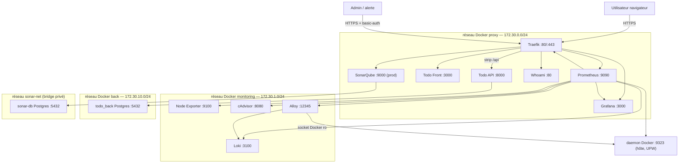
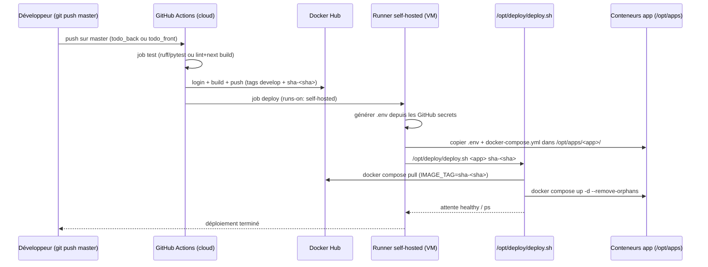

# 2. Vue d'ensemble de l'architecture

## 2.1 Principe : un serveur = une pile complète

L'infrastructure tient sur **un seul serveur**. Le point d'entrée du trafic
externe est **Traefik** (ports `80`/`443` publiés). **Aucun autre conteneur ne
publie de port sur l'hôte** : tout le reste circule sur des réseaux Docker
internes.

```
                     ┌──────────────────────────────────────────────┐
  Internet ──(80/443)►│  Traefik (reverse-proxy TLS)               │
  user / alerte      │   ├─ Grafana    : grafana.<IP>.nip.io        │
                     │   ├─ Prometheus : prometheus.<IP>.nip.io     │
                     │   ├─ Traefik UI : traefik.<IP>.nip.io        │
                     │   ├─ Whoami     : whoami.<IP>.nip.io         │
                     │   ├─ SonarQube  : sonar.<IP>.nip.io (prod)   │
                     │   └─ Todo App   : todo.<IP>.nip.io (/api+UI) │
                     └──────────────┬───────────────────────────────┘
                                    │  réseaux Docker internes
                   ┌────────────────┴────────────────────────────────┐
                   │  Prometheus ◄── node-exporter / cadvisor /      │
                   │                 daemon-docker (9323) / Traefik / │
                   │                 grafana / loki / alloy           │
                   │  Loki      ◄── Grafana Alloy (logs Docker,      │
                   │                 syslog, access logs Traefik)     │
                   │  Grafana   ──► contact points e-mail/Telegram/  │
                   │                 Slack (+ Discord désactivé)      │
                   │  SonarQube ──► PostgreSQL 16                     │
                   └──────────────────────────────────────────────────┘
```

## 2.2 Schéma Mermaid — vue applicative et réseau



## 2.3 Schéma Mermaid — pipeline CI/CD (déploiement applicatif)



## 2.4 Rôle et dépendances de chaque composant

| Composant | Rôle | Dépend de | Dépendance de |
|---|---|---|---|
| **Traefik** | Reverse-proxy, TLS (ACME), routage par labels | Réseau `proxy` ; `docker.sock` (ro) | Tout service web (routes) |
| **whoami** | Service de test de routage | Réseau `proxy` | — |
| **Node Exporter** | Métriques hôte (CPU, RAM, disque, réseau, load) | Réseau `monitoring` | Prometheus (scrape) |
| **cAdvisor** | Métriques conteneurs (CPU, RAM, I/O, restarts) | Réseau `monitoring` ; `/var/lib/docker` ro | Prometheus (scrape) |
| **Prometheus** | Collecte + TSDB, `docker_sd` | Réseaux `proxy`+`monitoring` ; `docker.sock` ro | Grafana, alerting |
| **Loki** | Agrégation/stockage des logs | Réseau `monitoring` | Alloy (push) ; Grafana (lecture) |
| **Alloy** | Collecteur de logs → Loki | `docker.sock` ro ; `/var/log` ; `/opt/traefik/logs` | Loki |
| **Grafana** | Console + alerting (datasources, dashboards, contact points) | Réseaux `proxy`+`monitoring` | Prometheus + Loki |
| **SonarQube** | Qualité du code (prod) | Réseau `proxy`+`sonar-net` | sonar-db |
| **sonar-db** | Base PostgreSQL de SonarQube | `sonar-net` | SonarQube |
| **daemon Docker** | Métriques 9323 + socket (docker_sd/Alloy/runners) | UFW (autorisation réseaux internes) | Prometheus, Alloy, runners |
| **Trivy** | Scan de vulnérabilités des images de conteneurs (timer quotidien) | `/opt/trivy` ; `docker.sock` ro (conteneur éphémère) | Rapports JSONL → Alloy → Loki |
| **todo_back** | API FastAPI + migrations Alembic | `proxy`+`back` | todo_back_postgres |
| **todo_back_postgres** | Base PostgreSQL de l'application | `back` | todo_back |
| **todo_front** | Front Next.js (standalone) | `proxy` | todo_back (via Traefik `/api`) |

## 2.5 Réseaux Docker (subnets fixes)

| Réseau | Subnet | Gateway | Usage |
|---|---|---|---|
| `proxy` | `172.30.0.0/24` | `172.30.0.1` | Traefik + services exposés (web) |
| `monitoring` | `172.30.1.0/24` | `172.30.1.1` | Collecteurs et sources de métriques (intranet) |
| `back` | `172.30.10.0/24` | `172.30.10.1` | Données / API privées des apps (jamais exposé) |
| `sonar-net` | bridge privé (auto) | — | SonarQube ↔ sonar-db |

> **Pourquoi des subnets fixes ?** Les règles **UFW** de la VM autorisent le
> daemon Docker (9323) depuis exactement les subnets `proxy` et `monitoring`.
> Sans subnets épinglés, ces règles seraient fragiles après recréation des
> réseaux.

## 2.6 Réseaux et flux externes

| Flux | Source → Destination | Ports | Protocole | Chiffré |
|---|---|---|---|---|
| HTTP | Internet → Traefik | 80 | TCP | non (redirigé 301 vers HTTPS) |
| HTTPS | Internet → Traefik | 443 | TCP | oui (Let's Encrypt / selfsigned) |
| HTTPS (ACME challenge HTTP-01) | Let's Encrypt → Traefik | 80 | TCP | — |
| SSH | Admin → serveur | 22 | TCP | oui (clé) |
| Métriques daemon Docker | réseaux internes → hôte | 9323 | TCP | non (interne) |
| Scopus Prometheus (internes) | Prometheus → cibles | 9100/8080/8082/9090/3000/3100/12345 | HTTP (interne) | non (interne) |

> ⚠️ Tous les flux internes (entre conteneurs) ne sont **pas** chiffrés. C'est
> un choix assumé : ils restent confinés aux réseaux Docker privés, jamais
> routés par Traefik. Pour aller plus loin en prod, voir chapitre 9.5.

---


